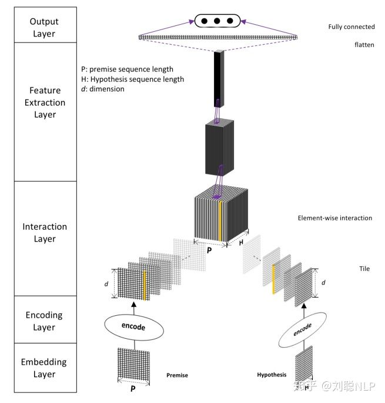

# 【关于 DIIN 】那些你不知道的事  

> 作者：杨夕
> 
> 项目地址：https://github.com/km1994/nlp_paper_study
> 
> 个人介绍：大佬们好，我叫杨夕，该项目主要是本人在研读顶会论文和复现经典论文过程中，所见、所思、所想、所闻，可能存在一些理解错误，希望大佬们多多指正。
> 
> 论文：Densely Interactive Inference Network
> 
> 会议：TACL2017
> 
> 论文地址：https://arxiv.org/abs/1702.03814

## 模型介绍

模型主要包括五层：嵌入层（Embedding Layer）、编码层（Encoding Layer）、交互层（Interaction Layer ）、特征提取层（Feature Extraction Layer）和输出层（Output Layer），如图1所示。

## 参考

1. [论文阅读笔记：文本蕴含之DIIN](https://zhuanlan.zhihu.com/p/73526585)
2. [论文阅读笔记: Natural Language Inference over Interaction Space](https://www.cnblogs.com/databingo/p/9311892.html)
3. [文本匹配、文本相似度模型之DIIN](https://blog.csdn.net/u012526436/article/details/90710925)