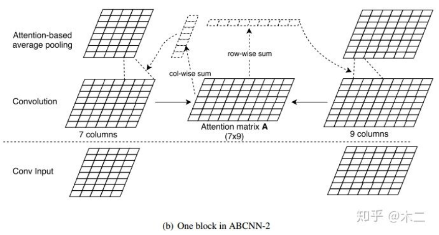
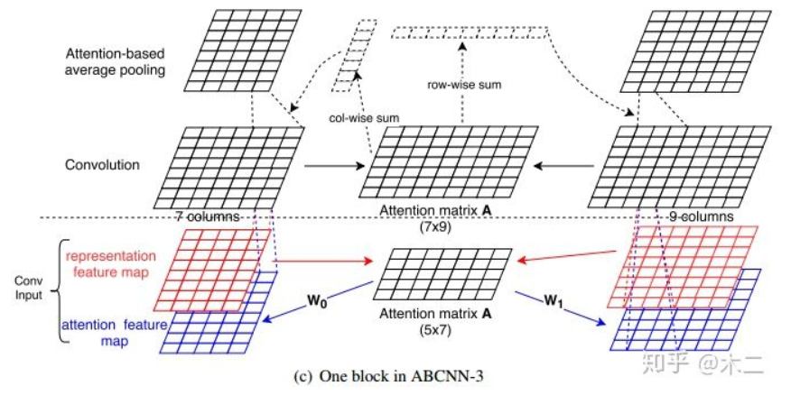
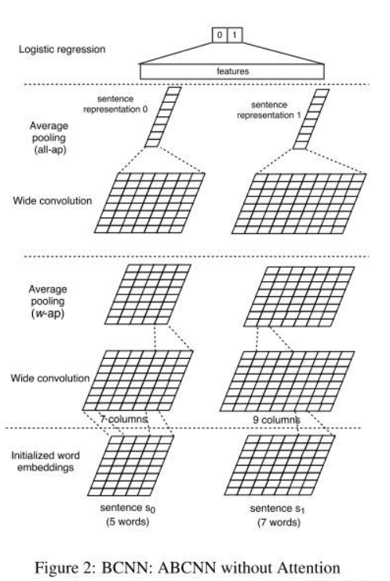
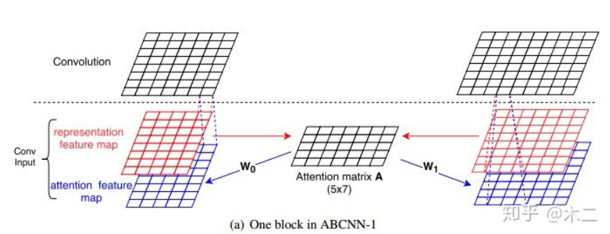

# 【关于 文本匹配模型 ABCNN 】那些你不知道的事

> 作者：杨夕
> 
> 项目地址：https://github.com/km1994/nlp_paper_study
> 
> 个人介绍：大佬们好，我叫杨夕，该项目主要是本人在研读顶会论文和复现经典论文过程中，所见、所思、所想、所闻，可能存在一些理解错误，希望大佬们多多指正。
> 
> 论文：ABCNN: Attention-Based Convolutional Neural Network for Modeling Sentence Pairs
> 
> 论文地址：https://arxiv.org/pdf/1609.06038.pdf
> 
> 会议：TACL 2016

## 目录

- [【关于 文本匹配模型 ABCNN 】那些你不知道的事](#关于-文本匹配模型-abcnn-那些你不知道的事)
  - [目录](#目录)
  - [前言](#前言)
  - [网络架构](#网络架构)
    - [BCNN](#bcnn)
    - [ABCNN-1](#abcnn-1)
    - [ABCNN-2](#abcnn-2)
    - [ABCNN-3](#abcnn-3)
  - [参考资料](#参考资料)

## 前言

在文本任务上，大部分模型均是采用以LSTM为主的结构，本文的作者采用了CNN的结构来提取特征，并用attention机制进行进一步的特征处理，作者一共提出了三种attention的建模方法，下文会详细介绍。

## 网络架构

### BCNN

提出一种基本的CNN模型（无attention机制），它基于Siamese架构，包含两个权重共享的CNN网络，每个网络处理一个句子，最后一层解决sentence pair task。BCNN网络架构包含四种类型的层：输入层，卷积层，平均池化层，输出层。

### ABCNN-1

ABCNN-1是在输入层加入attention机制，由representation feature map生成注意力矩阵A，将 W0 ，W1 作用于A生成attention feature map，然后将注意力特征图与句子表示特征图进行拼接，作为新的输入，其实就是将输入由单通道扩展为双通道。作者说这样做的理由是生成的attention feature map可以引导卷积操作来学习另一个句子的表示。

### ABCNN-2

ABCNN-2是对卷积的输出进行attention操作，目的是为了将卷积输出结果进行注意力权重的分配。与ABCNN-1相同，也会首先生成注意力矩阵A，计算方法与ABCNN-1相同。然后ABCNN-2会分别为两个句子计算attention权重向量，即图中所示的col-wise sum 与 row-wise sum，计算方法为将矩阵A的行与列分别求和，col-wise sum的每个值代表句子s0的每个单词分配的注意力权重，row-wise sum的每个值代表句子s1的每个单词分配的注意力权重。利用生成的attention权重向量对卷积层的输出进行加权，然后做average pooling。

### ABCNN-3

ABCNN-3就是将ABCNN-1和ABCNN-2结合，这样既能在输入粒度也能在更抽象的输出粒度执行attention操作。

## 参考资料

1. [论文笔记：ABCNN 阅读和实现(PyTorch)](https://zhuanlan.zhihu.com/p/48254913)
2. [文本匹配、文本相似度模型之ABCNN](https://blog.csdn.net/u012526436/article/details/90179481)