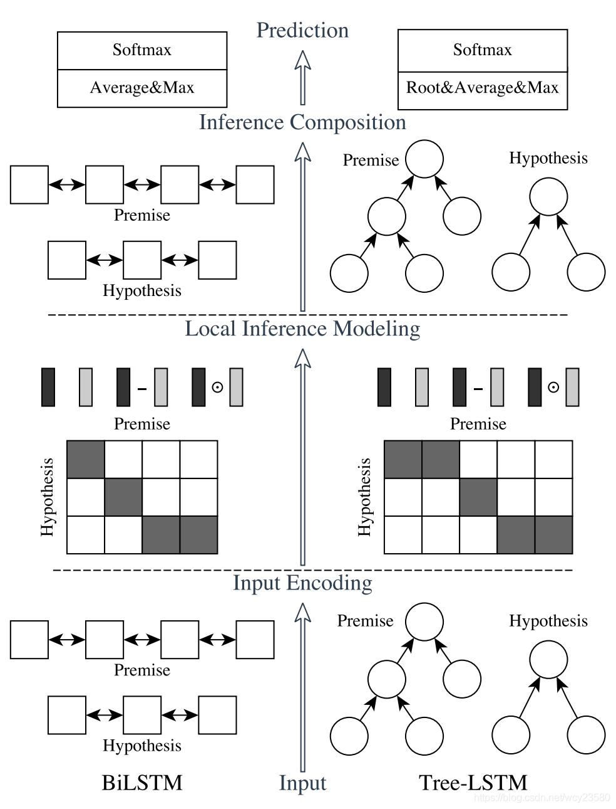
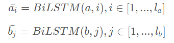
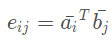
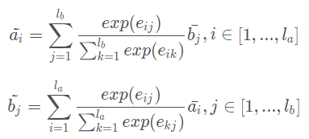
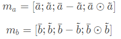

# 【关于 文本匹配模型 ESIM 】那些你不知道的事 

> 作者：杨夕
> 
> 项目地址：https://github.com/km1994/nlp_paper_study
> 
> 个人介绍：大佬们好，我叫杨夕，该项目主要是本人在研读顶会论文和复现经典论文过程中，所见、所思、所想、所闻，可能存在一些理解错误，希望大佬们多多指正。
> 
> 论文：Enhanced LSTM for Natural Language Inference
> 
> 会议：TACL2017
> 
> 论文地址：https://arxiv.org/pdf/1609.06038.pdf

## 目录

- [【关于 文本匹配模型 ESIM 】那些你不知道的事](#关于-文本匹配模型-esim-那些你不知道的事)
  - [目录](#目录)
  - [一、动机篇](#一动机篇)
  - [二、ESIM 模型篇](#二esim-模型篇)
    - [2.1 模型介绍](#21-模型介绍)
    - [2.2 Input Encoding](#22-input-encoding)
    - [2.3 Local Inference Modeling](#23-local-inference-modeling)
    - [2.4 Inference Composition](#24-inference-composition)
    - [2.5 Prediction](#25-prediction)
    - [2.6 模型训练](#26-模型训练)
  - [参考](#参考)

## 一、动机篇

- 自然语言推理（NLI: natural language inference）问题：
  - 即判断能否从一个前提p中推导出假设h
  - 简单来说，就是判断给定两个句子的三种关系：蕴含、矛盾或无关

在Query 扩召回项目中，通过各种手段挖掘出一批同义词，想对其进行流程化，所以考虑加上语义推断，作为竞赛神器 ESIM 模型，该模型在近两年横扫了好多比赛，算是 NLI (Natural Language Inference) 领域未来几年一个很难绕过的超强 baseline 了，单模型的效果可以达到 88.0% 的 Acc。

- 创新点
  - 精细的设计序列式的推断结构；
  - 考虑局部推断和全局推断。

## 二、ESIM 模型篇

### 2.1 模型介绍


> 模型整体结构

- 模型结构图分为左右两边：
- 左侧就是 ESIM，
- 右侧是基于句法树的 tree-LSTM，两者合在一起交 HIM (Hybrid Inference Model)。
- 整个模型从下往上看，分为三部分：
  - input encoding；
  - local inference modeling；
  - inference composition；
  - Prediction

以 ESIM 为例

### 2.2 Input Encoding

- step1 : 输入一般可以采用预训练好的词向量或者添加embedding层，这里介绍采用的是embedding层;
- step2 ：采用一个双向的LSTM，起作用主要在于对输入值做encoding，也可以理解为在做特征提取，
- step3 ：把其隐藏状态的值保留下来，


> BiLSTM 公式

> 其中i与j分别表示的是不同的时刻，a与b表示的是上文提到的p与h。

- 代码讲解

```s
  def forward(self):
    # step 1 : input encoding  : embeding + BiLSTM
    p_embedding = tf.nn.embedding_lookup(self.embedding, self.p)
    h_embedding = tf.nn.embedding_lookup(self.embedding, self.h)
    with tf.variable_scope("lstm_p", reuse=tf.AUTO_REUSE):
        (p_f, p_b), _ = self.bilstm(p_embedding, self.config['embedding_hidden_size'])
    with tf.variable_scope("lstm_p", reuse=tf.AUTO_REUSE):
        (h_f, h_b), _ = self.bilstm(h_embedding, self.config['embedding_hidden_size'])
    p = tf.concat([p_f, p_b], axis=2)
    h = tf.concat([h_f, h_b], axis=2)
    p = self.dropout(p)
    h = self.dropout(h)
    ...
```

### 2.3 Local Inference Modeling

- 目标：将上一轮 所提取到的 特征值 做 差异值 计算；
- 所用方法： Attention
- 步骤
  - s1： 计算 Attention weight（如 图 1）
  - s2： 根据attention weight计算出a与b的权重加权后的值（如 图 2）【作用：通过Attention的方式，以 a 为query向量，text_right中的所有单词的表征作为key向量和value向量，那么就可以计算得到text_left中单词 wa 基于text_right中单词的表征 a‘】
  - s3： 得到encoding值与加权encoding值之后，下一步是分别对这两个值做差异性计算，作者认为这样的操作有助于【强化每个单词的表征】，论文有两种计算方法：
    - 对位相减
    - 对位相乘
  - s4： 把encoding两个状态的值与相减、相乘的值拼接起来（如 图 3）


> 图 1


> 图 2
> 注：计算 a 时，是与 b 做 加权，而非自身，b 同理


> 图 3

- 代码

```s
  def forward(self):
    ...
    # step 2 : local inference modeling
    ## 2.1 首先计算两个句子 word 之间的相似度，得到2维的相似度矩阵，这里会用到 torch.matmul 
    e = tf.matmul(p, tf.transpose(h, perm=[0, 2, 1]))
    ## 2.2 然后才进行两句话的 local inference。用之前得到的相似度矩阵，结合 a，b 两句话，互相生成彼此相似性加权后的句子，维度保持不变。
    a_attention = tf.nn.softmax(e)
    b_attention = tf.transpose(tf.nn.softmax(tf.transpose(e, perm=[0, 2, 1])), perm=[0, 2, 1])
    a = tf.matmul(a_attention, h)
    b = tf.matmul(b_attention, p)
    ## 2.3 在 local inference 之后，进行 Enhancement of local inference information。这里的 enhancement 就是计算 a 和 align 之后的 a 的差和点积， 体现了一种差异性吧，更利用后面的学习。
    m_a = tf.concat((a, p, a - p, tf.multiply(a, p)), axis=2)
    m_b = tf.concat((b, h, b - h, tf.multiply(b, h)), axis=2)
    ...
```

### 2.4 Inference Composition

在这一层中，把之前的值再一次送到了BiLSTM中，这里的BiLSTM的作用和之前的并不一样，这里主要是用于捕获局部推理信息 $m_a$ 和 $m_b$ 及其上下文，以便进行推理组合。

最后把BiLSTM得到的值进行池化操作，分别是最大池化与平均池化，并把池化之后的值再一次的拼接起来。


- 代码

```s
  def forward(self):
    ...
    # step 3 : inference composition
    ## 3.1 用 BiLSTM 提取上下文信息
    with tf.variable_scope("lstm_a", reuse=tf.AUTO_REUSE):
        (a_f, a_b), _ = self.bilstm(m_a, self.config['context_hidden_size'])
    with tf.variable_scope("lstm_b", reuse=tf.AUTO_REUSE):
        (b_f, b_b), _ = self.bilstm(m_b, self.config['context_hidden_size'])
    a = tf.concat((a_f, a_b), axis=2)
    b = tf.concat((b_f, b_b), axis=2)
    a = self.dropout(a)
    b = self.dropout(b)
    ## 3.2 使用 MaxPooling 和 AvgPooling 进行池化操作
    a_avg = tf.reduce_mean(a, axis=2)
    b_avg = tf.reduce_mean(b, axis=2)
    a_max = tf.reduce_max(a, axis=2)
    b_max = tf.reduce_max(b, axis=2)
    v = tf.concat((a_avg, a_max, b_avg, b_max), axis=1)
    ...
```

### 2.5 Prediction

- 目标：预测
- 思路：
  - s1：把 V 送入到全连接层，激活函数采用的是tanh；
  - s2：将得到的结果送到softmax层。

- 代码

```s
  def forward(self):
    ...
    # step 4 : 预测
    ## 4.1 拼接 一个 全连接层
    v = tf.layers.dense(v, self.config['hidden'], activation='tanh')
    v = self.dropout(v)
    logits = tf.layers.dense(v, self.config['class_size'], activation='tanh')
    ## 4.2 拼接 一个 softmax 层
    self.prob = tf.nn.softmax(logits, name="logits")
    self.prediction = tf.argmax(logits, axis=1, name="predictions")
    self.train(logits)
```

### 2.6 模型训练

- 代码介绍：

```s
  def train(self, logits):
    y = tf.one_hot(self.y, self.config['class_size'])
    # 计算最后一层是softmax层的cross entropy，
    # 把softmax计算与cross entropy计算放到一起了，
    # 用一个函数来实现，用来提高程序的运行速度。
    loss = tf.nn.softmax_cross_entropy_with_logits(labels=y, logits=logits)
    self.loss = tf.reduce_mean(loss)
    self.train_op = tf.train.AdamOptimizer(self.config['learning_rate']).minimize(self.loss)
    correct_prediction = tf.equal(tf.cast(self.prediction, tf.int32), self.y)
    self.acc = tf.reduce_mean(tf.cast(correct_prediction, tf.float32))
```

- 损失函数介绍

```s
  tf.nn.softmax_cross_entropy_with_logits(labels=y, logits=pred, name=None)
```

函数功能：计算最后一层是softmax层的cross entropy，把softmax计算与cross entropy计算放到一起了，用一个函数来实现，用来提高程序的运行速度。

- 参数介绍
  - 参数name：该操作的name
  - 参数labels：shape是[batch_size, num_classes]，神经网络期望输出。
  - 参数logits：shape是[batch_size, num_classes] ，神经网络最后一层的输入。

## 参考

1. [文本匹配、文本相似度模型之ESIM](https://blog.csdn.net/u012526436/article/details/90380840)
2. [短文本匹配的利器-ESIM](https://zhuanlan.zhihu.com/p/47580077)