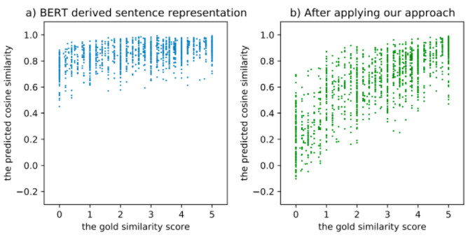
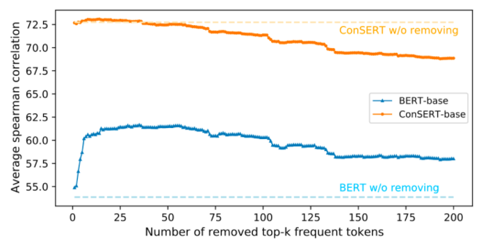
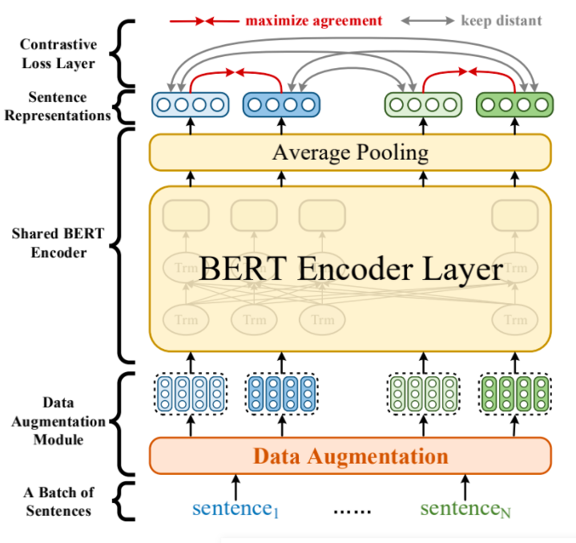
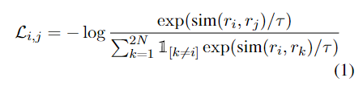
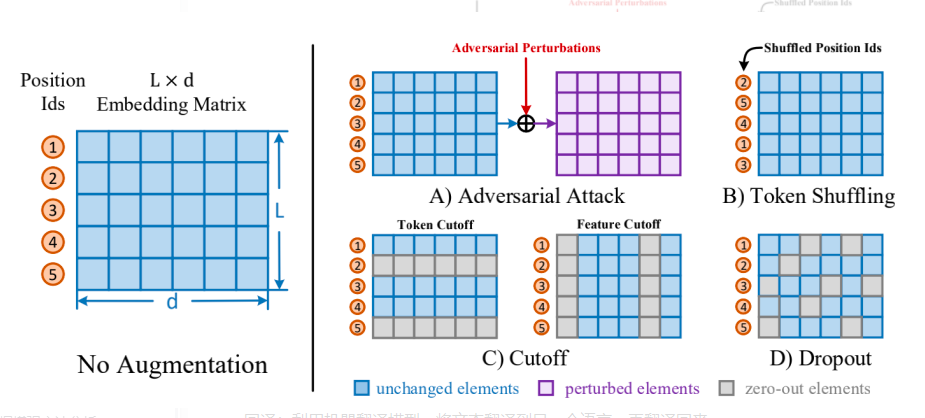

# 【关于 SimCSE】 那些你不知道的事

> 作者：杨夕
> 
> 项目地址：https://github.com/km1994/nlp_paper_study
> 
> 论文：ConSERT: A Contrastive Framework for Self-Supervised Sentence Representation Transfer
> 
> 会议：ACL 2021
> 
> github：https://github.com/yym6472/ConSERT
> 
> 个人介绍：大佬们好，我叫杨夕，该项目主要是本人在研读顶会论文和复现经典论文过程中，所见、所思、所想、所闻，可能存在一些理解错误，希望大佬们多多指正。
> 
> 论文地址：https://arxiv.org/abs/2105.11741

## 一、动机

- **Bert 句子表示 “坍缩（Collapse）”现象**：BERT对所有的句子都**倾向于编码到一个较小的空间区域内**，这**使得大多数的句子对都具有较高的相似度分数**，即使是那些语义上完全无关的句子对；

> 图1 左：BERT表示空间的坍缩问题（横坐标是人工标注的相似度分数，纵坐标是模型预测的余弦相似度）；右：经过我们的方法Fine-tune之后

- **BERT句向量表示的坍缩和句子中的高频词有关**。当通过平均词向量的方式计算句向量时，那些**高频词的词向量将会主导句向量，使之难以体现其原本的语义**。当计算句向量时去除若干高频词时，坍缩现象可以在一定程度上得到缓解。

> 计算句向量时移除Top-K高频词后的性能变化

- BERT导出的句向量难以直接用于下游的语义匹配任务，而用于Fine-tune的监督语料又是昂贵的。**是否有一种自监督的方法，只需要收集少量来自于下游任务无标注的文本用于Fine-tune，就能解决BERT句向量的“坍缩”问题，同时让其表征更适用于下游任务**。

## 二、核心思想

利用 对比学习（Contrastive Learning） 的 方法来解决 以上问题。

### 2.1 什么是对比学习？

- 核心思想为：人类是通过“对比”来辨别对象的，因此**相似的事物在编码后的表示空间中应当相近，不同的事物则应当相距尽可能远**。通过对同一样本施加不同的数据增强方法，我们能够得到一系列“自相似”的文本对作为正例，同时将同一个Batch内的其他文本作为负例，以此为监督信号去规范BERT的表示空间。
- 实验结果：**对比学习能够出色地消解高频词对句子语义表示的干扰**（如图2橙色曲线所示）。在经过对比学习训练之后，模型生成的句子表示将不再由高频词主导（体现在移除前几个高频词后，性能没有出现非常明显的变化）。
  
### 2.2 为什么对比学习能解决 **Bert 句子表示 “坍缩（Collapse）”问题**

这是因为**对比学习“辨别自身”的学习目标能够天然地识别并抑制这类高频特征，从而避免语义相差较大的句子表示过于相近（即坍缩现象）**。

## 三、模型介绍

### 3.1 问题定义

给定一个类似BERT的预训练语言模型 M，以及从目标领域数据分布中收集的无标签文本语料库 D，我们希望**通过构建自监督任务在 D 上对 M 进行Fine-tune，使得Fine-tune后的模型能够在目标任务（文本语义匹配）上表现最好**。

### 3.2 基于对比学习的句子表示迁移框架

> ConSERT的基本框架

- 模块介绍
  - **数据增强模块**：作用于Embedding层，为同一个句子生成两个不同的增强版本（View）；
  - **共享的BERT编码器**，为输入的句子生成句向量；
  - **对比损失层**，用于在一个Batch的样本中计算对比损失，其思想是最大化同一个样本不同增强版本句向量的相似度，同时使得不同样本的句向量相互远离

### 3.3 ConSERT 训练过程

训练时，先从数据集 D 中采样一个Batch的文本，设Batch size为 N。通过数据增强模块，每一个样本都通过两种预设的数据增强方法生成两个版本，得到总共 2N 条样本。这 2N 条样本均会通过共享的BERT编码器进行编码，然后通过一个平均池化层，得到 2N 个句向量。我们采用和SimCLR一致的NT-Xent损失对模型进行Fine-tune

### 3.4 ConSERT 用于文本领域的数据增强方法探索

#### 3.4.1 传统的基于文本的数据增强

> 四种高效的数据增强方法：Adversarial Attack、Token Shuffling、Cutoff、Dropout，均作用于Embedding层

- 传统的基于文本的数据增强
  - 回译：利用机器翻译模型，将文本翻译到另一个语言，再翻译回来；
  - CBERT  ：将文本的部分词替换成[MASK]，然后利用BERT去恢复对应的词，生成增强句子；
  - 意译（Paraphrase）：利用训练好的Paraphrase生成模型生成同义句

- 存在问题：
  - 不一定能保证语义一致；
  - 每一次数据增强都需要做一次模型Inference，开销会很大

#### 3.4.2 在Embedding层隐式生成增强样本的方法

1. 方法

- 对抗攻击（Adversarial Attack）：这一方法通过梯度反传生成对抗扰动，将该扰动加到原本的Embedding矩阵上，就能得到增强后的样本。由于生成对抗扰动需要梯度反传，因此这一数据增强方法仅适用于有监督训练的场景。
- 打乱词序（Token Shuffling）：这一方法扰乱输入样本的词序。由于Transformer结构没有“位置”的概念，模型对Token位置的感知全靠Embedding中的Position Ids得到。因此在实现上，我们只需要将Position Ids进行Shuffle即可。
- 裁剪（Cutoff）：又可以进一步分为两种：
  - Token Cutoff：随机选取Token，将对应Token的Embedding整行置为零。
  - Feature Cutoff：随机选取Embedding的Feature，将选取的Feature维度整列置为零。
- Dropout：Embedding中的每一个元素都以一定概率置为零，与Cutoff不同的是，该方法并没有按行或者按列的约束。

2. 优点

- 优点：这四种方法均可以方便地通过对Embedding矩阵（或是BERT的Position Encoding）进行修改得到，因此相比显式生成增强文本的方法更为高效。

### 3.5 ConSERT 进一步融合监督信号

除了无监督训练以外，我们还提出了几种进一步融合监督信号的策略：

1. **联合训练（joint）**：有监督的损失和无监督的损失通过加权联合训练模型。
2. **先有监督再无监督（sup-unsup）**：先使用有监督损失训练模型，再使用无监督的方法进行表示迁移。
3. **联合训练再无监督（joint-unsup）**：先使用联合损失训练模型，再使用无监督的方法进行表示迁移。

## 五、总结

分析了BERT句向量表示空间坍缩的原因，并提出了一种基于对比学习的句子表示迁移框架ConSERT。ConSERT在无监督Fine-tune和进一步融合监督信号的实验中均表现出了不错的性能；同时当收集到的样本数较少时，仍能有不错的性能提升，表现出较强的鲁棒性。

## 参考

- [美团在ACL2021上提出基于对比学习的文本表示模型，效果提升8%](https://blog.csdn.net/qq_27590277/article/details/117608941)

