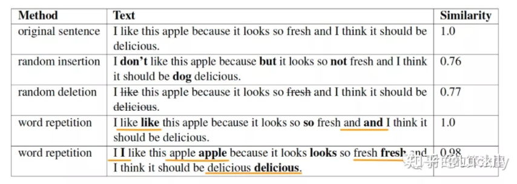
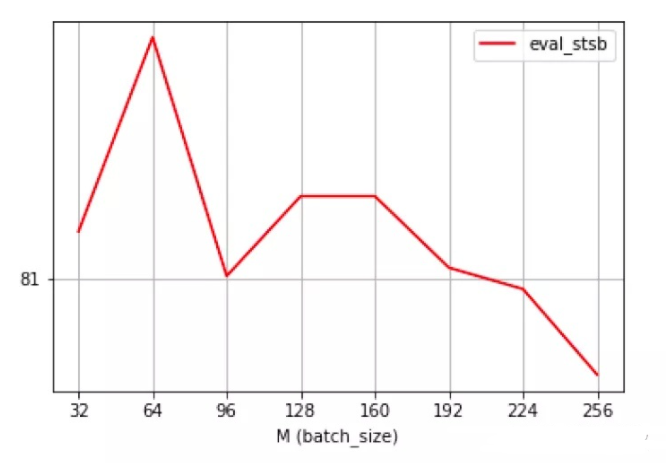
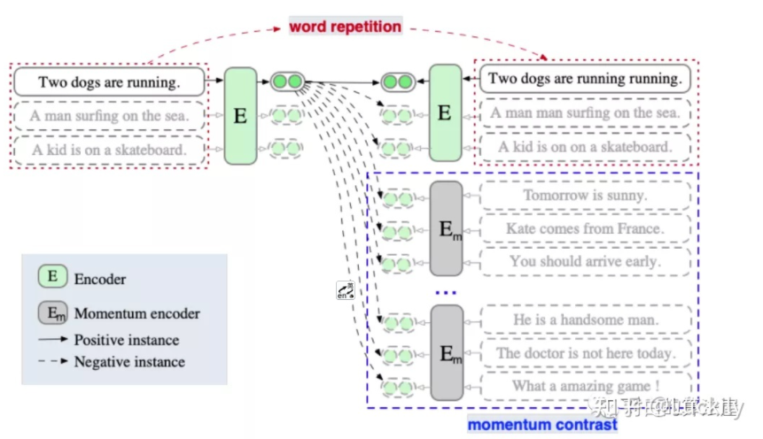
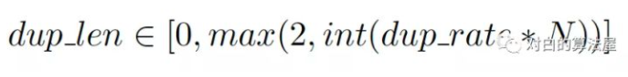
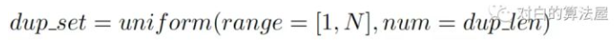
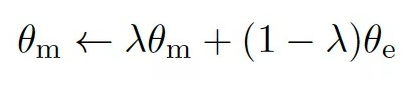
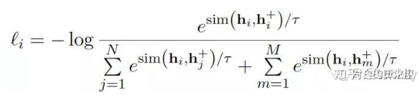

# 【关于 ESimCSE】 那些你不知道的事

> 作者：杨夕
> 
> 项目地址：https://github.com/km1994/nlp_paper_study
> 
> 论文：ESimCSE: Enhanced Sample Building Method for Contrastive Learning of Unsupervised Sentence Embedding
> 
> 会议：
> 
> github：https://blog.csdn.net/m0_45478865/article/details/120873082
> 
> 个人介绍：大佬们好，我叫杨夕，该项目主要是本人在研读顶会论文和复现经典论文过程中，所见、所思、所想、所闻，可能存在一些理解错误，希望大佬们多多指正。
> 
> 论文地址：https://arxiv.org/abs/2105.11741

## 一、动机

SimCSE遗留的两个问题:

1. **SimCSE通过dropout构建的正例对包含相同长度的信息**（原因：Transformer的Position Embedding），会使模型倾向于认为相同或相似长度的句子在语义上更相似（insight很合理）；
2. **更大的batch size会导致SimCSE性能下降**（这点确实很困扰）;

## 二、ESimCSE 介绍

### 2.1 针对 SimCSE 解决方案

- 问题一：**SimCSE通过dropout构建的正例对包含相同长度的信息**
  - 解决方法：提出 “Word Repetition”，它随机复制句子中的一些单词

- 问题二：**更大的batch size会导致SimCSE性能下降** 由于对比学习是在正例对和负例对之间进行的，理论上更多的负例对可以导致更好的比较。因此一个潜在的优化方向是利用更多的负例对，鼓励模型进行更精细的学习。然而在SimCSE中，更大的batch size并不总是更好的选择。例如，如下图所示, 对于无监督的SimCSE-BERTbase模型，最佳batch size大小为 64，batch size大小的其他设置会降低性能。
  - 解决方法：为了缓解扩展batch size时GPU内存的限制，一个可行的方法是**引入动量对比**，这也是通过维护一个队列，重用来自前一个mini-batch的编码Embedding来扩展负例对：它总是**将当前mini-batch的句子Embedding入队，同时将“最旧”的句子Embedding出队。由于入队的句子Embedding来自前面的mini-batch**，我们通过取其参数的移动平均值来保持动量更新模型，并使用动量模型生成入队的句子Embedding。请注意，作者在使用动量编码器时关闭了dropout，这可以缩小训练和预测之间的差距。

### 2.2 ESimCSE 方法介绍

首先介绍ESimCSE构建正例对的方法：Word Repetition（单词重复）和 Momentum Contrast（动量对比学习）扩展负样本对。

#### 2.2.1 Word Repetition

Word Repetition单词重复机制会随机复制句子中的一些单词/子词。这里我们以子词重复为例，给定一个句子s，经过子词分词器处理后，我们得到一个子词序列 ，N是序列的长度。我们将重复标记的数量定义为：

其中dup_rate是最大重复率，这是一个超参数。dup_len是上面定义的集合中的随机采样数，这将在扩展序列长度时引入更多的多样性。确定dup_len后，我们使用均匀分布从序列中随机选择需要重复的dup_len子词，组成dup_set。

#### 2.2.2 Momentum Contrast

Momentun Contrast（动量对比）允许我们通过维护固定大小的队列来重用来自紧邻的前面mini-batch中编码的句子Embedding。具体来说，队列中的Embedding会被逐步替换。若当前mini-batch中输出句子的Embedding入队时，如果队列已满，则删除队列中“最旧”的句子Embedding。

我们使用动量更新编码器对排队的句子Embedding进行编码，我们按以下方式更新 ：‍‍‍‍‍‍‍‍‍‍‍‍‍‍‍‍‍‍‍‍‍‍‍‍‍‍‍‍‍‍

通过队列中的句子Embedding，ESimCSE的损失函数进一步修改如下:

## 三、总结

本文提出了两种优化方法来构建 unsup-SimCSE 的正负例对，并将它们与 unsup-SimCSE 相结合，称为ESimCSE。通过大量实验，所提出的 ESimCSE 在标准语义文本相似性任务上比 unsup-SimCSE 取得了相当大的改进。

## 参考

- [语义理解篇--ESimCSE：无监督语义新SOTA，引入动量对比学习扩展负样本，效果远超SimCSE](https://zhuanlan.zhihu.com/p/448091624)
- [ESimCSE：无监督句子嵌入对比学习的增强样本构建方法](https://zhuanlan.zhihu.com/p/409124038)
- [ESimCSE: Enhanced Sample Building Method for Contrastive Learning of Unsupervised Sentence Embedding](https://blog.csdn.net/zpp13hao1/article/details/122298240)
- [【对比学习&双塔模型】在语义表征中的应用（三）：SOTA比拼？SBERT/SimCSE/ConSERT/ESimCSE复现](https://zhuanlan.zhihu.com/p/450993543)

