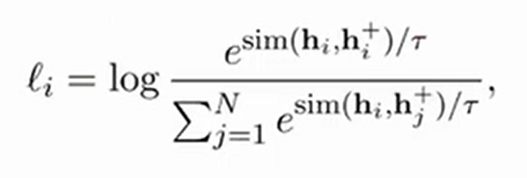
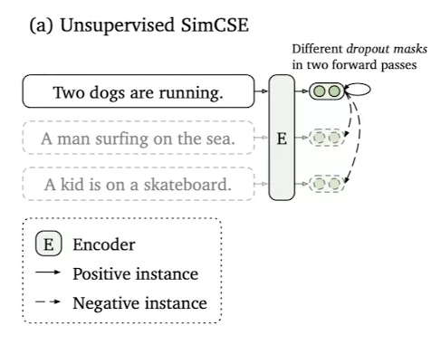
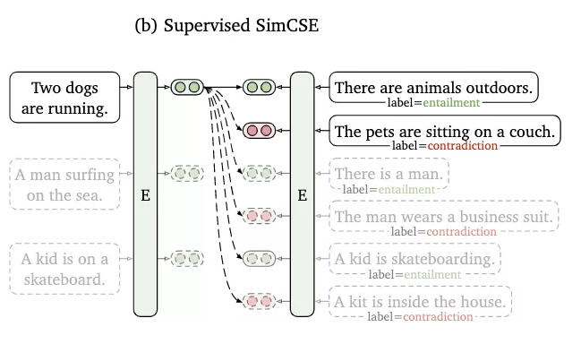
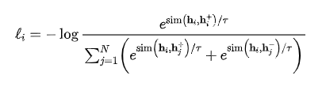
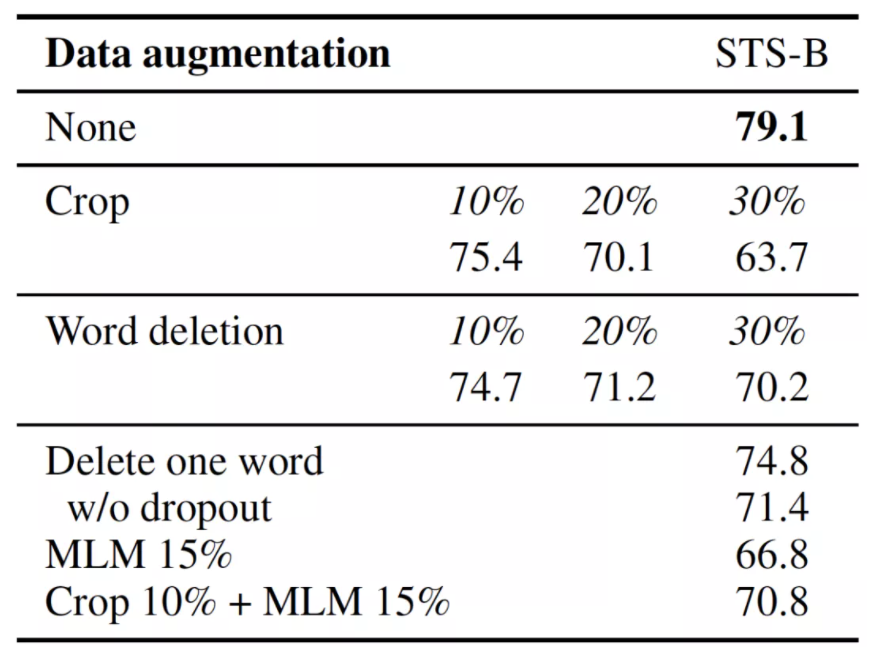
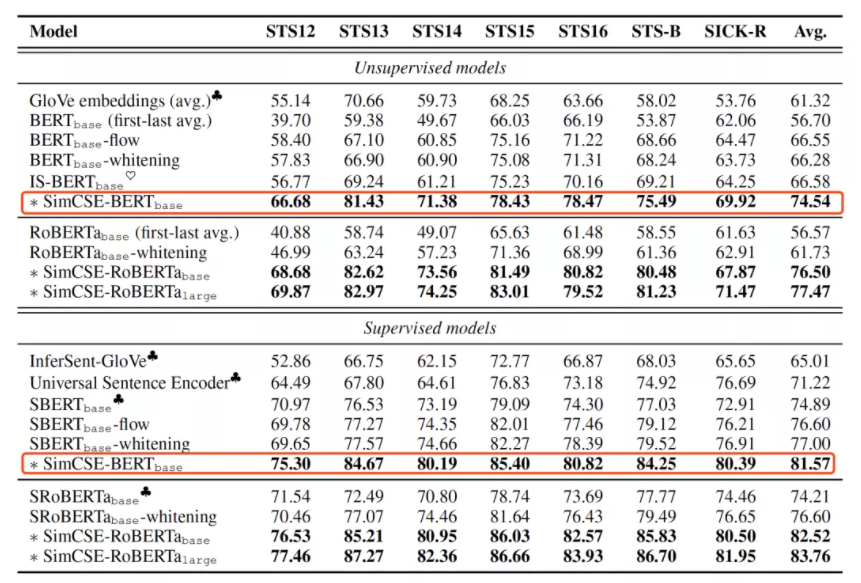
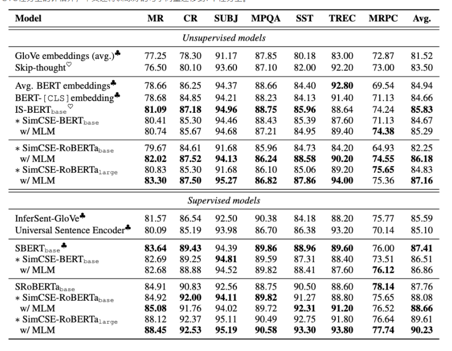

# 【关于 SimCSE】 那些你不知道的事

> 作者：杨夕
> 
> 项目地址：https://github.com/km1994/nlp_paper_study
> 
> 论文：SimCSE: Simple Contrastive Learning of Sentence Embeddings
> 
> github：https://github.com/princeton-nlp/SimCSE
> 
> 个人介绍：大佬们好，我叫杨夕，该项目主要是本人在研读顶会论文和复现经典论文过程中，所见、所思、所想、所闻，可能存在一些理解错误，希望大佬们多多指正。
> 
> 论文地址：https://arxiv.org/abs/2104.08821

- [【关于 SimCSE】 那些你不知道的事](#关于-simcse-那些你不知道的事)
  - [一、论文摘要](#一论文摘要)
  - [二、对比学习](#二对比学习)
    - [2.1 什么是对比学习？](#21-什么是对比学习)
    - [2.2 对比学习 的 损失函数](#22-对比学习-的-损失函数)
    - [2.3 对比学习为何work？[4]](#23-对比学习为何work4)
      - [2.3.1 优化目标](#231-优化目标)
      - [2.3.2 衡量指标](#232-衡量指标)
      - [2.3.3 论文思路](#233-论文思路)
  - [三、SimCSE 介绍](#三simcse-介绍)
    - [3.1 SimCSE  方法提出](#31-simcse--方法提出)
    - [3.2 无监督 SimCSE](#32-无监督-simcse)
      - [3.2.1 介绍](#321-介绍)
      - [3.2.2 如何生成dropout mask？](#322-如何生成dropout-mask)
    - [3.3 有监督 SimCSE](#33-有监督-simcse)
      - [3.2.1 介绍](#321-介绍-1)
  - [四、实验结果分析](#四实验结果分析)
    - [4.1 Dropout优于传统数据增强？](#41-dropout优于传统数据增强)
    - [4.2 Dropout与对比学习的关系](#42-dropout与对比学习的关系)
    - [4.3 语义文本相似效果如何？](#43-语义文本相似效果如何)
    - [4.4 迁移学习效果](#44-迁移学习效果)
  - [五、实践](#五实践)
    - [5.1 安装](#51-安装)
      - [5.1.1 pip 安装](#511-pip-安装)
      - [5.1.2 code 安装](#512-code-安装)
    - [5.2 import SimCSE](#52-import-simcse)
    - [5.3 encoding sentences into embeddings](#53-encoding-sentences-into-embeddings)
    - [5.4 Compute the cosine similarities between two groups of sentences](#54-compute-the-cosine-similarities-between-two-groups-of-sentences)
  - [参考](#参考)

## 一、论文摘要

本文介绍了 SimCSE，这是一个简单的对比学习框架，极大地推进了最先进的句子嵌入。

- 思路：
  - 首先描述了一种无监督方法，它采用输入句子并在对比目标中预测自己，仅将标准 dropout 用作噪声。这种简单的方法效果出奇地好，与以前的受监督计数器部件相当。我们假设 dropout 充当最小数据增强的大小，删除它会导致表示崩溃。
  - 然后，我们从最近从自然语言推理 (NLI) 数据集中学习句子嵌入的成功中汲取灵感，并将 NLI 数据集中的注释对合并到对比学习中，方法是使用“蕴含”对作为正例，将“矛盾”对作为硬负例。

- 实验结果：
  - 作者评估了标准语义文本相似性（STS）任务上的 SimCSE，使用 BERT-base 的无监督和监督模型分别平均实现了 74.5％ 和 81.6％ 的 Spearman 相关性，与之前的最佳结果相比，分别提高了 7.9 和 4.6点。
  - 作者还表明，对比学习理论上将嵌入分布得更均匀，并且在有监督信号可用时，它可以更好地对齐正样本。

This  paper  presents  SimCSE,  a  simple  contrastive  learning  framework  that  greatly  advances  the  state-of-the-art  sentence  embeddings.   We first describe an unsupervised approach, which takes an input sentence and predicts itself in a contrastive objective, with only standard dropout used as noise.   This simple method  works  surprisingly  well,  performing on par with previous supervised counter parts. We hypothe size that dropout acts as minimal data augmentation and removing it leads to a representation collapse.  Then, we draw inspiration from the recent success of learning sentence  embeddings  from  natural  language  inference  (NLI)  datasets  and  incorporate  annotated pairs from NLI datasets into contrastive learning  by  using  “entailment”  pairs  as  positives  and  “contradiction”  pairs  as  hard  negatives. We  evaluate  SimCSE  on  standard semantic  textual  similarity  (STS)  tasks,  and our unsupervised and supervised models using BERT base achieve  an  average  of  74.5%  and 81.6% Spearman’s correlation respectively,  a 7.9 and 4.6 points improvement compared toprevious best results.  We also show that contrastive  learning theoretically  regularizes pre-trained  embeddings’  anisotropic  space  to  bemore  uniform,  and  it  better  aligns  positive pairs when supervised signals are available.

## 二、对比学习

### 2.1 什么是对比学习？

对比学习 一开始主要 在 CV 领域


> 注：给定图片 pic，对其进行 数据增广 得到 pic1 和 pic2，两张图片分别 得到 h1 和 h2，目标是 拉近 h1 和 h2 间的距离

- 思想：**拉近相似的样本，推开不相似的样本**，并从样本集 中学习到一个 好的语义空间。


### 2.2 对比学习 的 损失函数



> 在 2.1 中，拉近 h1 和 h2 间的距离 所用的方法 就是 通过降低 损失函数的值

> 分子是正例对的相似度，分母是正例对+所有负例对的相似度，最小化infoNCE loss，就是去最大化分子的同时最小化分母，也就是最大化正例对的相似度，最小化负例对的相似度

### 2.3 对比学习为何work？[4]

#### 2.3.1 优化目标

为了让 对比学习 能够 work，需要对以下两个目标进行优化：

- 目标一：正例之间表示保持较近距离；
- 目标二：随机样例的表示应分散在超球面上；

#### 2.3.2 衡量指标

1. 目标一的衡量指标：alignment

- 计算函数


> 注：该函数 主要用于计算 正例对(相似句子) ，映射到单位超球面后，之间的向量距离的期望<br/>
> 越相似的样例之间的alignment程度越高。因为alignment使用距离来衡量，所以距离越小，表示alignment的程度越高。


2. 目标二的衡量指标：uniformity


> 注：该函数 主要用于评估所有数据的向量均匀分布的程度<br/>
> 越均匀，保留的信息越多。


#### 2.3.3 论文思路

任意从表示空间中采样两个数据 x 和 y, 希望他们的距离比较远。他们的距离越远，证明空间分布越 uniform。所以 uniformity 的值也是越低越好。

SimCSE也采用这两个指标来衡量生成的句子向量，并证明了文本的语义空间也满足：**alignment值越低且uniformity值越低，向量表示的质量越高，在STS任务上的Spearman相关系数越高。**

## 三、SimCSE 介绍

### 3.1 SimCSE  方法提出

SimCSE 提出两种变体：

1. Unsupervised SimCSE
2. Supervised SimCSE

> 主要区别：主要不同在于对比学习的正负例的构造

### 3.2 无监督 SimCSE

#### 3.2.1 介绍

- 思路：引入dropout给输入加噪声；
- 假设加噪后的输入仍与原始输入在语义空间距离相近。其正负例的构造方式如下：


- 训练目标函数：


- 样例介绍



#### 3.2.2 如何生成dropout mask？

对于Unsupervised SimCSE，核心在于如何生成dropout mask。

**因为BERT内部每次dropout都随机会生成一个不同的dropout mask。**所以SimCSE不需要改变原始BERT，只需要将同一个句子喂给模型两次，得到的两个向量就是应用两次不同dropout mask的结果。然后将两个向量作为正例对。

### 3.3 有监督 SimCSE

#### 3.2.1 介绍



- 思路：**利用标注数据来构造对比学习的正负例子**

> 为探究哪种标注数据更有利于句子向量的学习，文中在多种数据集上做了实验，最后发现**NLI数据最有利于学习句子表示**。

- 引入了NLI任务来监督对比学习过程：

1. 该模型假设如果两个句子存在蕴含关系，那么它们之间的句子向量距离应该较近；
2. 如果两个句子存在矛盾关系，那么它们的距离应该较远。

因此 NLI 中的蕴含句对和矛盾句对分别对应对比学习中的正例对和负例对。

- 构造方式：

1. 正例：NLI 中 entailment 关系样例对；
2. 负例：
   1. a) in-batch negatives 
   2. b) NLI中关系为 contradiction 的样例对。

- 损失函数：



## 四、实验结果分析

### 4.1 Dropout优于传统数据增强？

下图中对比了使用Unsupervised SimCSE （第一行None）和常见的数据增强方法在STS-B验证集上的Spearman's Correlation。



其中crop k%表示随机减掉k%长度的span，word deletion表示随机删除k%的词，delete one word只删除一个词，MLM 15%表示用 Bert(base) 随机替换掉15%的词。上表中所有dropout的方法的dropout的比例都是0.1。(因为文中对比了不同比例的dropout，p=0.1效果最好。）

实验结果很明显的可以看出，SimCSE是远超其余数据增强方法的。小花的理解是传统数据增强的方法是对原始输入直接进行改变，在编码后，增强的数据与原始数据在语义空间的距离是不是要比直接用dropout的方式要远。

### 4.2 Dropout与对比学习的关系

为了理解dropout为什么work，作者可视化了不同方法下alignment和uniformity在训练过程中的变化趋势。


上图中对比了在不同数据增强/dropout方式下，l(uniformity) 和 l(alignment) 在训练过程中的变化方向（每训练10步采样一次）。Fix 0.1表示p=0.1时，两次使用相同dropout mask。对于Fixed 0.1和No dropout来讲，正例对的句子表示是完全相同的，

可以看到随着训练步数增加，Unsup. SimCSE的 l(uniformity)  平稳地递减。虽然 l(alignment) 降低的趋势却不明显，但其初始化的值就相对较低。上图进一步验证了SimCSE有效的原因是，它可以让alingnment和uniformity的值逐渐降低。

### 4.3 语义文本相似效果如何？

SimCSE在STS（语义文本相似）任务上进行了评估。评价指标是 Spearman’s correlation。



表格中对比了各种建模句子向量的方法，包括简单的对Glove向量取平均，到前不久的SOTA:BERT-Flow和BERT-Whitening。可以看到，在各种编码器和有无监督模式下，SimCSE都取得了显著的提升。比如无监督时，BERT(base) 和 RoBERTa(base) 与BERT-Whitening相比，Avg. 分别提升了7.96%和14.77%。

此外，作者还对比了不同句子表示模型下 l(uniformity) 和 l(alignment)  与他们在STS任务上的结果：


- 可以看出：
  - Avg.BERT模型的 l(alignment) 较低，但 l(uniformity) 较高；
  - 相反，对BERT表示进行后处理的 BERT-flow 和 BERT-whitening 的 l(uniformity) 较低，但是 l(alignment)  却很高；
  - Unsup.SimCSE和SimCSE的两个值都是较低的，他们的STS的结果也更好。


说明 l(uniformity) 和 l(alignment) 需要结合使用，只有当二者的值都比较低时，模型学习到的句子向量表示才最适合STS任务。

### 4.4 迁移学习效果

除了STS任务上的评估外，本文还将训练好的句子向量迁移到7个任务上。



迁移学习上的SimCSE并没有展现出明显的优势。作者的解释是句子级别的训练目标并不能直接有利于迁移学习。为了让迁移学习效果更好，文中还是尝试将MLM损失和对比学习损失一起训练，取得了少量的提升（上表中标有w/MLM的行)。

## 五、实践

> 参考： [princeton-nlp/SimCSE](https://github.com/princeton-nlp/SimCSE)

### 5.1 安装

#### 5.1.1 pip 安装

```python
  pip install simcse
```

#### 5.1.2 code 安装

```python
  python setup.py install
```

### 5.2 import SimCSE

```python
  import jieba
  from simcse import SimCSE
  model = SimCSE("princeton-nlp/sup-simcse-bert-base-uncased")
```

### 5.3 encoding sentences into embeddings

```python
query_list = [
     "行政机关强行解除行政协议造成损失，如何索取赔偿？",
     "借钱给朋友到期不还得什么时候可以起诉？怎么起诉？",
     "我在微信上被骗了，请问被骗多少钱才可以立案？",
     "公民对于选举委员会对选民的资格申诉的处理决定不服，能不能去法院起诉吗？",
     "有人走私两万元，怎么处置他？",
     "法律上餐具、饮具集中消毒服务单位的责任是不是对消毒餐具、饮具进行检验？"
]
query_cut_list = [" ".join(jieba.cut(query)) for query in query_list]
embeddings = model.encode(query_cut_list[0])
embeddings
>>>
tensor([ 0.0747, -0.0126, -0.0167, -0.0450,  0.0732,  0.0445,  0.0025,  0.0332,...])
```

### 5.4 Compute the cosine similarities between two groups of sentences

```python
similarities = model.similarity(query_cut_list, query_cut_list)
similarities
>>>
array([[0.9999999 , 0.7445762 , 0.77073973, 0.76386297, 0.7195432 , 0.8021217 ],
       [0.7445762 , 0.9999999 , 0.90396184, 0.8445153 , 0.8344078 , 0.8870599 ],
       [0.77073973, 0.90396184, 0.99999994, 0.84666795, 0.8676584 , 0.9215424 ],
       [0.76386297, 0.8445153 , 0.84666795, 1.        , 0.78612614, 0.90282255],
       [0.7195432 , 0.8344078 , 0.8676584 , 0.78612614, 1.        , 0.8056324 ],
       [0.8021217 , 0.8870599 , 0.9215424 , 0.90282255, 0.8056324 , 1.0000001 ]], dtype=float32)
```

## 参考

1. [丹琦女神新作：对比学习，简单到只需要Dropout两下](https://mp.weixin.qq.com/s/BpbI_S9lXofVFdu8qffIkg)
2. [SimCSE: Simple Contrastive Learning of Sentence Embeddings](https://arxiv.org/abs/2104.08821)
3. [princeton-nlp/SimCSE](https://github.com/princeton-nlp/SimCSE)
4. [Alignment and Uniformity on the Hypersphere](https://arxiv.org/abs/2005.10242)
5. [超细节的对比学习和SimCSE知识点](https://zhuanlan.zhihu.com/p/378340148)