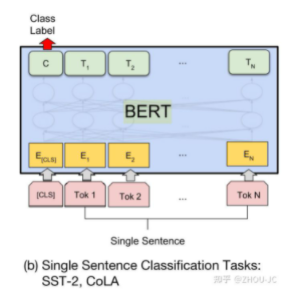
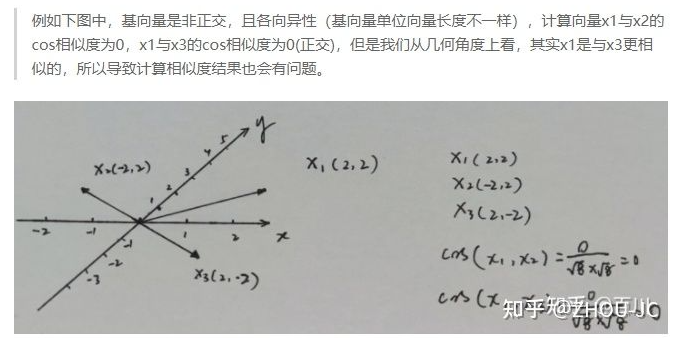
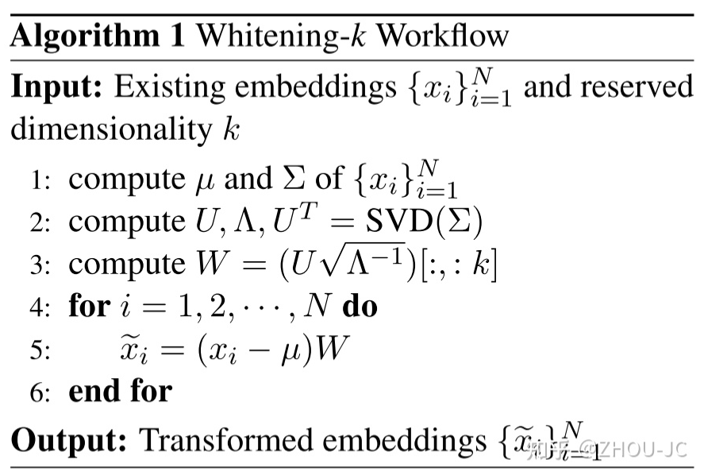

# 句子向量、语义匹配 之 BERT_avg/BERT_Whitening/SBERT/SimCSE

## 一、BERT-avg

 - 做法：拿预训练后的模型来做相似度匹配

- 如何做 sent embedding:
  - CLS token：利用 CLS token 最后一层作为 embedding;
  - 取序列最后一层的输出：做 max or mean:
    - 分类任务：max 效果更好；
    - 匹配任务：mean 效果更好；
  - 把第一层和最后一层的输出加起来后做平均（有研究表明头几层，主要蕴含词汇信息，靠任务的层主要蕴含语义信息，把它们拼接起来，让两种信息得到融合）。
- 如何计算相似度：对 embedding 后的两个句子 计算 余弦相似度

- 问题：效果差
  - 原因：存在各向异性

> 我理解的是输出的每个token是768维的（即向量空间的基向量由768个768维的向量组成），embedding的数值大小取决于当前选的坐标系，假如当前坐标系非标准正交基，则会出现空间上是正交的向量（空间正交不依赖于坐标系，无论你取哪个作为基底，在空间中它们就是正交），但在该坐标系下计算出的投影不为0。

## 二、BERT-Whitening

> [论文 《Whitening Sentence Representations for Better Semantics and Faster Retrieval》](https://arxiv.org/abs/2103.15316)  
> [代码](https://github.com/bojone/BERT-whitening)

- 解决方法：对语料数据求特征值分解，然后把当前坐标系变换到标准正交基。
- 思路：

1. 首先把当前任务的语料，一句句地输入到预训练模型中得到各自的embedding;
2. 然后对embeddings做特征值分解，得到变换矩阵，存起来;
3. 应用时，把新的句子输入预训练模型，得到句子embedding，再用存起来的变换矩阵 u 和 W 做坐标变换，这时候变换后的embedding就是标准正交基表示的embedding。

## 三、SBERT

> [论文 《Sentence-BERT: Sentence Embeddings using Siamese BERT-Networks》](https://arxiv.org/abs/1908.10084)  
> [代码](https://github.com/UKPLab/sentence-transformers)

## 参考

1. [NLP系列之句子向量、语义匹配（二）：BERT_avg/BERT_Whitening/SBERT/SimCSE—方法解读](https://zhuanlan.zhihu.com/p/387765206)