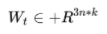
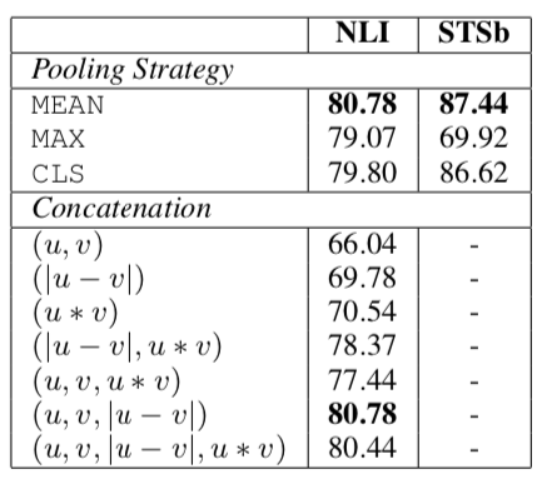
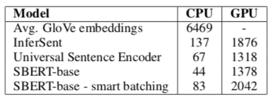
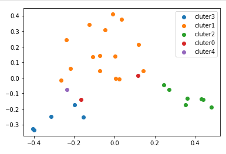

# 【关于 Sentence-BERT】 那些你不知道的事

> 作者：杨夕
> 
> 项目地址：https://github.com/km1994/nlp_paper_study
> 
> 论文：Sentence-BERT: Sentence Embeddings using Siamese BERT-Networks
> 
> github:https://github.com/UKPLab/sentence-transformers
> 
> 个人介绍：大佬们好，我叫杨夕，该项目主要是本人在研读顶会论文和复现经典论文过程中，所见、所思、所想、所闻，可能存在一些理解错误，希望大佬们多多指正。
> 
> 论文地址：chrome-extension://ikhdkkncnoglghljlkmcimlnlhkeamad/pdf-viewer/web/viewer.html?file=https%3A%2F%2Farxiv.org%2Fpdf%2F1908.10084.pdf

- [【关于 Sentence-BERT】 那些你不知道的事](#关于-sentence-bert-那些你不知道的事)
  - [一、动机](#一动机)
    - [1.1 小问题：在语义相似度任务中，SBERT的计算速度为什么比纯bert进行句子编码要快？](#11-小问题在语义相似度任务中sbert的计算速度为什么比纯bert进行句子编码要快)
      - [1.1.1 Bert 做 语义相似度任务](#111-bert-做-语义相似度任务)
    - [1.1.2 Sentence-BERT 做 语义相似度任务](#112-sentence-bert-做-语义相似度任务)
    - [1.1.3 问题分析](#113-问题分析)
  - [二、解决方法](#二解决方法)
  - [三、方法介绍](#三方法介绍)
    - [3.1 对 BERT 的输出添加 三种 pooling operation](#31-对-bert-的输出添加-三种-pooling-operation)
    - [3.2 针对不同的任务，建立三种目标函数](#32-针对不同的任务建立三种目标函数)
  - [四、实验结果](#四实验结果)
    - [4.1 模型效果对比实验](#41-模型效果对比实验)
    - [4.2 消融实验](#42-消融实验)
    - [4.3 计算开销试验](#43-计算开销试验)
  - [五、实践](#五实践)
    - [5.1 安装 sentence-transformers](#51-安装-sentence-transformers)
      - [5.1.1 基础环境](#511-基础环境)
      - [5.1.2 Install with pip](#512-install-with-pip)
      - [5.1.3 Install from sources](#513-install-from-sources)
    - [5.2 加载预训练模型](#52-加载预训练模型)
    - [5.3 句子编码](#53-句子编码)
    - [5.4 聚类](#54-聚类)
    - [5.5 微调](#55-微调)
  - [参考](#参考)

## 一、动机

- 方法一：BERT使用交叉编码器：将两个句子传递到变压器网络，并预测目标值；
  - 问题： 由于太多可能的组合，此设置不适用于各种对回归任务。 在n = 10000个句子的集合中找到相似度最高的对需要BERT n·（n-1）/ 2 = 49 995 000推理计算。 在现代V100 GPU上，这大约需要65个小时。 类似地，对于一个新问题，找到Quora的超过4,000万个现有问题中最相似的一个可以建模为与BERT的成对比较，但是，回答单个查询将需要50多个小时。

- 方法二：解决聚类和语义搜索的常用方法是将每个句子映射到向量空间，以使语义相似的句子接近。 研究人员已开始将单个句子输入BERT，并得出固定大小的句子嵌入。 最常用的方法是平均BERT输出层（称为BERT嵌入）或通过使用第一个令牌的输出（[CLS]令牌）；
  - 问题：就像我们将要展示的那样，这种常规做法产生的句子嵌入效果很差，通常比平均GloVe嵌入效果更差。

### 1.1 小问题：在语义相似度任务中，SBERT的计算速度为什么比纯bert进行句子编码要快？

> 注：这里有一个小问题：SBERT(sentence-bert)在原文中提到，使用原始bert对1w个句子进行两两相似度判别时，需要计算5000w次，十分耗时（65h）。而SBERT是将句子对送入Siamese网络中，进行判断，只需要花费5s时间，我不太理解为什么SBERT速度要快这么多？

首先，先看看以下两个图片：


> 图1 Bert 做 语义相似度任务 的模型结构


> 图2 Sentence-BERT 做 语义相似度任务 的模型结构

#### 1.1.1 Bert 做 语义相似度任务

Bert 做 语义相似度任务 时，sent1 和 sent2 的合并方式如 图1 ，这种方式类似于 文本匹配任务中的基于交互式的文本匹配方法（eg：ESIM）

- 这种方式的特点**在于 sent1 和 sent2 两个句子 每计算一次 相似度时，都需要进行拼接（拼接方式：[CLS] sent1 [SEP] sent2 ），然后输入到 Bert 模型中计算相似度，也就是说所有句子 都要进行两两拼接**；
- 计算复杂度：由于 所有句子 都要进行两两拼接，假设对 1W 个句子做相似度计算，那么 需要计算 1w*(1w-1) 次；

### 1.1.2 Sentence-BERT 做 语义相似度任务

Sentence-BERT 做 语义相似度任务 时，sent1 和 sent2 是分开输入到 模型，方式如 图2 ，这种方式类似于 文本匹配任务中的基于表示式的文本匹配方法（eg：DSSM）

- 这种方式的特点**在于 sent1 和 sent2 两个句子 是分开输入到 模型中的，也就是 sent1 和 sent2 从 图2 中的 sentenceA 和 sentenceB 两头输入到模型，然后输入到 Sentence-BERT 模型中计算相似度，也就是说所有句子 都分开输入到模型的。**；
- 计算复杂度：需要计算 1w*(1w-1) 次；

### 1.1.3 问题分析

1. Bert 和 Sentence-BERT 不是都是需要 计算 1w*(1w-1) 次？

答：Bert 和 Sentence-BERT 是都是需要 计算 1w*(1w-1) 次，

- Bert 每一次都需要 将 sent1 和 sent2 两个句子进行拼接，然后输入到 Bert 模型中；
- Sentence-BERT 由于 所有句子是分开输入到模型，所有首先我们可以提前对所有句子计算一次 embedding，然后采用 词典进行存储，在计算相似的时候，只需要将句子的 embedding 输入到模型中两两之间计算cosine similarity就可以；

cosine similarity 每次计算的 时间成本 远低于 Bert 计算，所以时间大大降低；

## 二、解决方法

为了缓解此问题，我们开发了SBERT。 siamese network 体系结构使得可以导出输入句子的固定大小矢量。 使用余弦相似度或Manhatten / Euclidean距离之类的相似度度量，可以找到语义上相似的句子。 这些相似性度量可以在现代硬件上非常高效地执行，从而允许SBERT用于语义相似性搜索以及聚类。 **在10,000个句子的集合中查找最相似的句子对的复杂性从使用BERT的65小时减少到计算10,000个句子嵌入（使用SBERT约为5秒）和计算余弦相似度（〜0.01秒）**。 通过**使用优化的索引结构**，可以将找到最相似的Quora问题从50小时减少到几毫秒。

## 三、方法介绍


### 3.1 对 BERT 的输出添加 三种 pooling operation

- Using the output of the CLS-token；
- computing the mean of all output vectors (MEANstrategy)；
- computing a max-over-time of theoutput vectors (MAX-strategy)

### 3.2 针对不同的任务，建立三种目标函数

- Classification Objective Function（上图左）

1. 获取到 两句话 的 句子向量 u 和 v；
2. 将 u  、v 和二者按位求差向量 |u-v| 进行拼接;
3. 拼接好的向量乘上一个可训练的权重 Wt;


> 权重 Wt: 
> n: 句子向量维度；
> k: 类别数；

- Regression Objective Function （上图右）

目标函数是MSE-loss，直接对两句话的句子向量  和  计算余弦相似度，然后计算。

- Triplet Objective Function

在这个目标函数下，将模型框架进行修改，将原来的两个输入，变成三个句子输入。给定一个锚定句 a ，一个肯定句 p和一个否定句 n ，模型通过使 p和a 的距离小于 n和a 的距离，来优化模型。使其目标函数o最小，即：


> || · ||代表的是两个样本的距离，本文采用的是欧氏距离;<br/>
> S_a、S_p、S_n均为对应样本的sentence-Embedding。实验时，作者将超参数epsilon设为1.

## 四、实验结果

### 4.1 模型效果对比实验


> 如图2，以上为各个方法将输入句子转为sentence-vector后计算相似度，再计算相似度和实际结果之间的斯皮尔曼系数（结果乘以100）。从图中可见，SBERT的效果优于直接输入BERT。

### 4.2 消融实验



本实验检测了不同pooling方法和不同特征concat手段对结果的影响。最终发现，特征concat方式对结果有较大的影响，而pooling方法影响不大。特别的是，加上u*v这个特征后，效果反而会有所下降。

### 4.3 计算开销试验



该实验衡量了不同的句子Embedding生成方法的速度。从图中可以看出，在CPU上运行时，InferSent的速度比SBERT大约快65%；但切换到可并行的GPU后，transformer可并行的优势就显现出来，当SBERT采用聪明的batch size时，它的速度比InferSent快~9%。

## 五、实践

### 5.1 安装 sentence-transformers

#### 5.1.1 基础环境

- Python：3.6+
- PyTorch：1.6.0+
- transformers： v3.1.0+

#### 5.1.2 Install with pip

```python
  pip install -U sentence-transformers
```

#### 5.1.3 Install from sources

```python
  pip install -e .
```

### 5.2 加载预训练模型

```python
  from sentence_transformers import SentenceTransformer
  model = SentenceTransformer('distiluse-base-multilingual-cased/')
```

### 5.3 句子编码

```python
sentences = [
    '直肠癌术后,腰痛,失眠,高血压,冠状动脉性心脏病',
    '胰头穿刺物坏死组织中及散在少数异型腺体', 
    '右环指软组织坏死缺损骨外露'
]
sentence_embeddings = model.encode(sentences)
for sentence, embedding in zip(sentences, sentence_embeddings):
    print("Sentence:", sentence)
    print("Embedding:", embedding)
    print("")

>>>
Sentence: 直肠癌术后,腰痛,失眠,高血压,冠状动脉性心脏病
Embedding: [-0.0119922  -0.00989334 -0.02105599 -0.00211975  0.0053817   0.01109401
  0.05005152  0.0050672  ...]

Sentence: 胰头穿刺物坏死组织中及散在少数异型腺体
Embedding: [-1.35766473e-02  1.86436030e-03  4.87464741e-02 -1.58068594e-02
 -2.31463946e-02  8.62479443e-04 -1.27971289e-03 -2.61279885e-02
 -1.58957895e-02  5.97858941e-03 ...]

Sentence: 右环指软组织坏死缺损骨外露
Embedding: [ 4.50778659e-03  3.57338302e-02  2.78501119e-02 -1.78689975e-03
 -3.45587395e-02 -1.36120152e-02  ...]
```

### 5.4 聚类

```python
import numpy as np
import matplotlib.pyplot as plt
from sklearn.decomposition import PCA
 
def show_cluster_image(vectors, labels, excepted_labels=None):
    """
    根据数据绘制出聚类散点图，目前最多8个类别
    :param vectors: 向量
    :param labels: 该点属于哪个簇
    :param excepted_labels: 排除的标签，该标签不绘制
    :return:
    """
    # 降维
    estimator = PCA(n_components=2)
    data_set = estimator.fit_transform(vectors)
    # 分成若干个簇
    clusters = {}
    for index in range(len(data_set)):
        datum = data_set[index]
        # 标签所代表的簇
        label = labels[index]
        # 异常值目前不显示
        if excepted_labels and label in excepted_labels:
            continue
        if label not in clusters:
            clusters[label] = []
        clusters[label].append(datum)
    # 遍历簇
    for label, array in clusters.items():
        matrix = np.array(array)
        plt.scatter(matrix[:, 0], matrix[:, 1], label='cluter%d' % label)
 
    plt.legend(loc='upper right')
    plt.show()

# Corpus with example sentences
corpus = [
    "直肠癌术后,腰痛,失眠,高血压,冠状动脉性心脏病	高血压性脑病",
    "胰头穿刺物坏死组织中及散在少数异型腺体	多腺体功能亢进",
    "右环指软组织坏死缺损骨外露	手坏死",
    "子宫平滑肌瘤，伴腺瘤样瘤性平滑肌瘤和腺肌症；增生期样子宫内膜；慢性宫颈炎。	血管平滑肌瘤",
    "左侧气胸41双侧胸部颈部皮下气肿	操作后皮下气肿",
    "右腿截肢右腿功能障碍	睾丸功能障碍",
    "左上肺周围型低分化腺癌纵隔淋巴结转移 上呼吸道感染	呼吸道感染",
    "食道高-中分化鳞癌粒子植入术后	自主性高反射",
    "多脏器功能不全累及呼吸心肌肝肾凝血代谢等	手术后慢性肺功能不全",
    "2左侧11肋后肋骨折	肋骨多处骨折",
    "鼻咽癌根治性放射治疗	鼻咽恶性肿瘤",
    "双侧基底节区小腔隙灶脑白质脱髓鞘改变	基底节脑梗死",
    "直肠肿物性质待查	直肠脓肿",
    "慢性肺源性心脏心功能失代偿期	失认",
    "双侧甲状腺乳头状微小癌	微乳头状浆液性癌",
    "骨盆尤文氏肉瘤	骨盆部肿瘤",
    "右肾盂输尿管占位	囊性肾盂输尿管炎",
    "上呼吸道感染慢性咽炎感冒,口腔黏膜溃疡,胃镜检查,病毒性感冒	慢性咽炎",
    "急性脑梗死；高血压病；心肌缺血	无症状心肌缺血",
    "低血糖病胰腺内分泌病	内分泌失调",
    "特指手术后状态(右髋骨、手掌骨折术后)	手术后食管瘘",
    "T911椎体压缩性改变部分椎体退变	腺样体肥大",
    "右髋关节骨折脱位	踝关节脱位",
    "卵巢癌化疗后	卵巢损伤",
    "中枢神经系统EB病毒感染	原发中枢神经系统弥漫大B细胞淋巴瘤",
    "妊娠期糖尿病G4P1孕39+4周待产LOA	未特指的妊娠期糖尿病",
    "传染性单核细胞综合征	慢性单核细胞白血病",
    "支气管哮喘继发感染糖尿病高血压病;冠心病	支气管哮喘",
    "上颌前牙区骨内埋伏多生牙	牙折断",
    "狼疮足细胞病	狼疮性脑病"
  ]
corpus_embeddings = model.encode(corpus)
# Perform kmean clustering
num_clusters = 5
clustering_model = KMeans(n_clusters=num_clusters)
clustering_model.fit(corpus_embeddings)
cluster_assignment = clustering_model.labels_

clustered_sentences = [[] for i in range(num_clusters)]
for sentence_id, cluster_id in enumerate(cluster_assignment):
    clustered_sentences[cluster_id].append(corpus[sentence_id])

for i, cluster in enumerate(clustered_sentences):
    print("Cluster ", i)
    print(cluster)

>>>
Cluster  0
['左上肺周围型低分化腺癌纵隔淋巴结转移 上呼吸道感染\t呼吸道感染', '上呼吸道感染慢性咽炎感冒,口腔黏膜溃疡,胃镜检查,病毒性感冒\t慢性咽炎']
Cluster  1
['胰头穿刺物坏死组织中及散在少数异型腺体\t多腺体功能亢进', '子宫平滑肌瘤，伴腺瘤样瘤性平滑肌瘤和腺肌症；增生期样子宫内膜；慢性宫颈炎。\t血管平滑肌瘤', '食道高-中分化鳞癌粒子植入术后\t自主性高反射', '鼻咽癌根治性放射治疗\t鼻咽恶性肿瘤', '双侧基底节区小腔隙灶脑白质脱髓鞘改变\t基底节脑梗死', '直肠肿物性质待查\t直肠脓肿', '双侧甲状腺乳头状微小癌\t微乳头状浆液性癌', '骨盆尤文氏肉瘤\t骨盆部肿瘤', '低血糖病胰腺内分泌病\t内分泌失调', 'T911椎体压缩性改变部分椎体退变\t腺样体肥大', '卵巢癌化疗后\t卵巢损伤', '中枢神经系统EB病毒感染\t原发中枢神经系统弥漫大B细胞淋巴瘤', '传染性单核细胞综合征\t慢性单核细胞白血病', '上颌前牙区骨内埋伏多生牙\t牙折断', '狼疮足细胞病\t狼疮性脑病']
Cluster  2
['右环指软组织坏死缺损骨外露\t手坏死', '左侧气胸41双侧胸部颈部皮下气肿\t操作后皮下气肿', '右腿截肢右腿功能障碍\t睾丸功能障碍', '2左侧11肋后肋骨折\t肋骨多处骨折', '右肾盂输尿管占位\t囊性肾盂输尿管炎', '特指手术后状态(右髋骨、手掌骨折术后)\t手术后食管瘘', '右髋关节骨折脱位\t踝关节脱位']
Cluster  3
['直肠癌术后,腰痛,失眠,高血压,冠状动脉性心脏病\t高血压性脑病', '多脏器功能不全累及呼吸心肌肝肾凝血代谢等\t手术后慢性肺功能不全', '慢性肺源性心脏心功能失代偿期\t失认', '急性脑梗死；高血压病；心肌缺血\t无症状心肌缺血', '支气管哮喘继发感染糖尿病高血压病;冠心病\t支气管哮喘']
Cluster  4
['妊娠期糖尿病G4P1孕39+4周待产LOA\t未特指的妊娠期糖尿病']


# 展现聚类结果
show_cluster_image(corpus_embeddings, cluster_assignment)
```



### 5.5 微调

- 数据 格式

```s
  面部多处软组织切割伤	面部软组织下垂	0
  头晕.下肢浮肿[脾肾不足.血脉瘀滞]	盲肠瘀滞症	0
  多囊肾并出血	肾出血	1
  耳后粉瘤感染	耳后脓肿	0
  """升结肠ca术后复查,肠镜检查 肠道准备"""	胎儿镜检查	0
  继发性间质肺疾病	间质性肺病	1
  ...
```

- 训练代码

```s
import pandas as pd 
from tools.loader import load_json
import os
from sentence_transformers import SentenceTransformer, InputExample, losses, models,evaluation
from torch.utils.data import DataLoader
from torch import nn

class DataProcessor(object):
    def __init__(self, root, is_lower=True):
        self.task_data_dir = root
        self.train_path = os.path.join(self.task_data_dir, 'CHIP-CDN_train.txt')
        self.dev_path = os.path.join(self.task_data_dir, 'CHIP-CDN_dev.txt')
        self.test_path = os.path.join(self.task_data_dir, 'CHIP-CDN_test.txt')

    def get_train_sample(self):
        return self._pre_process(self.train_path, is_train=True)

    def get_dev_sample(self):
        return self._pre_process(self.dev_path, is_train=False)

    def _pre_process(self, path, is_train=True):
        df = pd.read_csv(path,encoding="utf-8",sep="\t",header=None)
        df.columns = ['sent1','sent2','label']
        if is_train:
            train_examples = []
            for index,row in df.T.iteritems():
                train_examples.append(
                    InputExample(texts=[row['sent1'], row['sent2']], label=float(row['label']))
                )
            return train_examples
        else:
            return df

if __name__ == "__main__":
    # 变量设置
    origin_data_path = "data/"
    # model_path = 'F:/document/datasets/nlpData/SBert/'
    model_path = "/content/drive/MyDrive/bert_series/sbert/"
    model_name = "distiluse-base-multilingual-cased"
    output_path = "output/"
  
    data_processor = DataProcessor(f"{origin_data_path}")
    train_examples = data_processor.get_train_sample()

    dev_examples = data_processor.get_dev_sample()

    model = SentenceTransformer(f"{model_path}{model_name}")
    train_dataloader = DataLoader(train_examples, shuffle=True, batch_size=128)
    train_loss = losses.CosineSimilarityLoss(model)

    evaluator = evaluation.EmbeddingSimilarityEvaluator(
        list(dev_examples['sent1']), list(dev_examples['sent2']), list(dev_examples['label'])
    )

    model.fit(train_objectives=[(train_dataloader, train_loss)], epochs=3, warmup_steps=100, evaluator=evaluator, evaluation_steps=5)

    model.save(f"{output_path}{model_name}_new")
```

- 参考:[Training Overview](https://www.sbert.net/docs/training/overview.html)


## 参考

1. [Sentence Transformers github](https://github.com/UKPLab/sentence-transformers)


