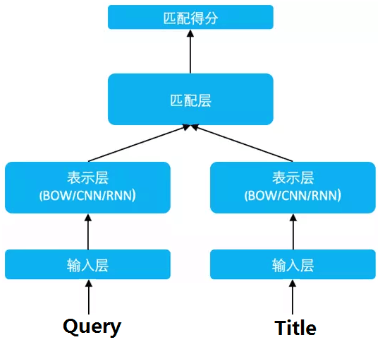
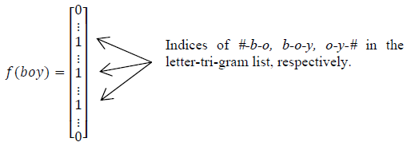
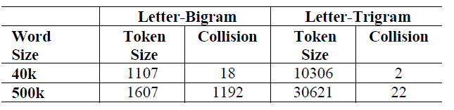
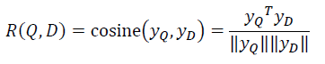
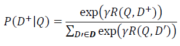
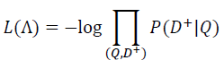

# 【关于 DSSM】 那些你不知道的事

> 作者：杨夕
> 
> 项目地址：https://github.com/km1994/nlp_paper_study
> 
> 论文：Deep Structured Semantic Model
> 
> 论文会议：CIKM2013
> 
> 论文地址：https://posenhuang.github.io/papers/cikm2013_DSSM_fullversion.pdf
> 
> 代码学习：https://github.com/km1994/TextMatching/tree/master/dssm
> 
> 个人介绍：大佬们好，我叫杨夕，该项目主要是本人在研读顶会论文和复现经典论文过程中，所见、所思、所想、所闻，可能存在一些理解错误，希望大佬们多多指正。

## 目录

- [【关于 DSSM】 那些你不知道的事](#关于-dssm-那些你不知道的事)
  - [目录](#目录)
  - [动机](#动机)
  - [DSSM （Deep Structured Semantic Models） 深度语义匹配模型介绍](#dssm-deep-structured-semantic-models-深度语义匹配模型介绍)
    - [思路](#思路)
    - [优点](#优点)
  - [模型结构介绍](#模型结构介绍)
    - [输入层](#输入层)
      - [(1) 英文](#1-英文)
      - [(2) 中文](#2-中文)
    - [特征提取层](#特征提取层)
    - [匹配层](#匹配层)
  - [评价](#评价)
  - [参考](#参考)

## 动机

- 问题：语义相似度问题
  - 字面匹配体现
    - 召回：在召回时，传统的文本相似性如 BM25，无法有效发现语义类 Query-Doc 结果对，如"从北京到上海的机票"与"携程网"的相似性、"快递软件"与"菜鸟裹裹"的相似性
    - 排序：在排序时，一些细微的语言变化往往带来巨大的语义变化，如"小宝宝生病怎么办"和"狗宝宝生病怎么办"、"深度学习"和"学习深度"；
  - 使用 LSA 类模型进行语义匹配，但是效果不好

##  DSSM （Deep Structured Semantic Models） 深度语义匹配模型介绍

### 思路

1. 利用 表示层 将 Query 和 Title 表达为低维语义向量；
2. 通过 cosine 距离来计算两个语义向量的距离，最终训练出语义相似度模型。

### 优点

该模型既可以用来预测两个句子的语义相似度，又可以获得某句子的低维语义向量表达

## 模型结构介绍

- 三层：
  - embedding 层对应图中的Term Vector，Word Hashing；
  - 特征提取层对应图中的，Multi-layer，Semantic feature；
  - 匹配层 Cosine similarity, Softmax；

### 输入层

#### (1) 英文

1. Term Vector 是文本转向量后的值
   
- 方法：
 - 论文中作者采用的是bag-of-words即词袋模型
 - 我的代码中会采用one-hot的形式。
  
1.  Word Hashing层

- 主流方法：英文主流文本转 vector 的方式更多是采用 embedding；
  - 问题：该方法有一个致命的问题就是会出现OOV的问题，
- 论文方法：提出了一种word hasing的方法，该方法一方面能降低输入数据的维度，其次也能保证不出现OOV的问题
  - 举例：
    - 假设用 letter-trigams 来切分单词（3 个字母为一组，#表示开始和结束符），boy 这个单词会被切为 #-b-o, b-o-y, o-y-# (如图 1)
  - 优点
    -  压缩空间：50 万个词的 one-hot 向量空间可以通过 letter-trigram 压缩为一个 3 万维的向量空间；
    -  增强范化能力。三个字母的表达往往能代表英文中的前缀和后缀，而前缀后缀往往具有通用的语义

> 图 1

> 图 2
> 
> 注：以 50 万个单词的词库为例，2 个字母的切分粒度的单词冲突为 1192（冲突的定义：至少有两个单词的 letter-bigram 向量完全相同），而 3 个字母的单词冲突降为 22 效果很好，且转化后的向量空间 3 万维不是很大，综合考虑选择 3 个字母的切分粒度

#### (2) 中文

- 问题：
  - 中文的输入层处理方式与英文有很大不同，首先中文分词是个让所有 NLP 从业者头疼的事情，即便业界号称能做到 95%左右的分词准确性，但分词结果极为不可控，往往会在分词阶段引入误差。所以这里我们不分词，而是仿照英文的处理方式，对应到中文的最小粒度就是单字了。（曾经有人用偏旁部首切的，感兴趣的朋友可以试试）

由于常用的单字为 1.5 万左右，而常用的双字大约到百万级别了，所以这里出于向量空间的考虑，采用字向量（one-hot）作为输入，向量空间约为 1.5 万维。

### 特征提取层

三个全连接层，激活函数采用的是tanh，把维度降低到128

用 Wi 表示第 i 层的权值矩阵，bi 表示第 i 层的 bias 项。则第一隐层向量 l1（300 维），第 i 个隐层向量 li（300 维），输出向量 y（128 维）可以分别表示为：

### 匹配层

Query 和 Doc 的语义相似性可以用这两个语义向量(128 维) 的 cosine 距离(即余弦相似度) 来表示：

通过 softmax 函数可以把 Query 与正样本 Doc 的语义相似性转化为一个后验概率：

其中 r 为 softmax 的平滑因子，D 为 Query 下的正样本，D-为 Query 下的负样本（采取随机负采样），D 为 Query 下的整个样本空间。

在训练阶段，通过极大似然估计，我们最小化损失函数：

残差会在表示层的 DNN 中反向传播，最终通过随机梯度下降（SGD）使模型收敛，得到各网络层的参数{Wi,bi}。

## 评价

- 优点
  - 减少切词的依赖：解决了LSA、LDA、Autoencoder等方法存在的一个最大的问题，因为在英文单词中，词的数量可能是没有限制，但是字母 n-gram 的数量通常是有限的
  - 基于词的特征表示比较难处理新词，字母的 n-gram可以有效表示，鲁棒性较强；
  - 传统的输入层是用 Embedding 的方式（如 Word2Vec 的词向量）或者主题模型的方式（如 LDA 的主题向量）来直接做词的映射，再把各个词的向量累加或者拼接起来，由于 Word2Vec 和 LDA 都是无监督的训练，这样会给整个模型引入误差，DSSM 采用统一的有监督训练，不需要在中间过程做无监督模型的映射，因此精准度会比较高；
  - 省去了人工的特征工程；
- 缺点
  - word hashing可能造成冲突
  - DSSM采用了词袋模型，损失了上下文信息
  - 在排序中，搜索引擎的排序由多种因素决定，由于用户点击时doc的排名越靠前，点击的概率就越大，如果仅仅用点击来判断是否为正负样本，噪声比较大，难以收敛

## 参考

1. [DSSM论文阅读与总结](https://blog.csdn.net/taoqick/article/details/103329627)
2. [DSSM：深度语义匹配模型](https://www.cnblogs.com/guoyaohua/p/9229190.html)
3. [文本匹配、文本相似度模型之DSSM](https://blog.csdn.net/u012526436/article/details/90212287)
