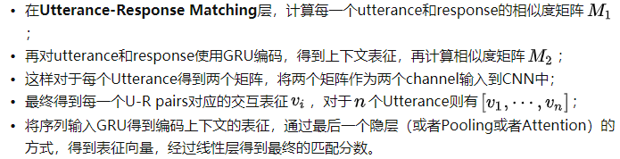
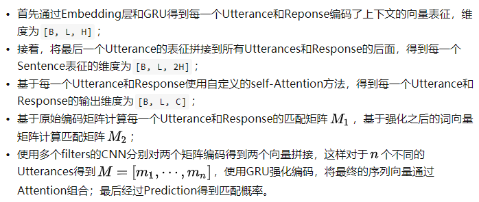
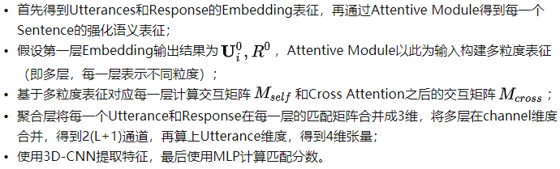
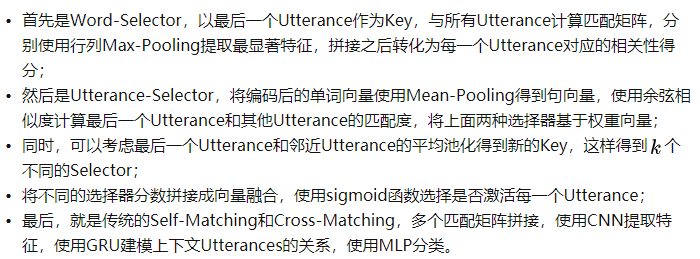
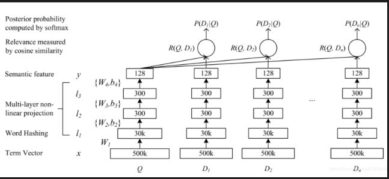

# 【关于 文本匹配】 那些你不知道的事

> 作者：杨夕
> 
> 项目地址：https://github.com/km1994/nlp_paper_study
> 
> 个人介绍：大佬们好，我叫杨夕，该项目主要是本人在研读顶会论文和复现经典论文过程中，所见、所思、所想、所闻，可能存在一些理解错误，希望大佬们多多指正。

## 目录

- [【关于 文本匹配】 那些你不知道的事](#关于-文本匹配-那些你不知道的事)
  - [目录](#目录)
  - [介绍](#介绍)
  - [前言方法：深度学习技术](#前言方法深度学习技术)
    - [基于表征（representation）的匹配：](#基于表征representation的匹配)
      - [DSSM](#dssm)
      - [CDSSM (2014)](#cdssm-2014)
    - [基于交互的文本匹配](#基于交互的文本匹配)
      - [ARC II (2014)](#arc-ii-2014)
      - [BiMPM (2017)](#bimpm-2017)
      - [ESIM (2017)](#esim-2017)
  - [关于多轮QA检索](#关于多轮qa检索)
    - [介绍](#介绍-1)
    - [Multi-view (2016)](#multi-view-2016)
    - [SMN (2017)](#smn-2017)
    - [DUA (2018)](#dua-2018)
    - [DAM (2018)](#dam-2018)
    - [MRFN (2019)](#mrfn-2019)
    - [DIM (2019)](#dim-2019)
    - [MSN (2019)](#msn-2019)
  - [参考](#参考)
  - [DSSM](#dssm-1)
    - [动机](#动机)
    - [思路](#思路)
    - [优点](#优点)
    - [缺点](#缺点)
  - [BiMPM](#bimpm)
    - [模型介绍](#模型介绍)
  - [DIIN](#diin)
    - [模型介绍](#模型介绍-1)
  - [ESIM](#esim)
    - [模型介绍](#模型介绍-2)
  - [资料](#资料)

## 介绍

- 类别
  - 文本检索（ad-hoc）
  - 释义识别（Paraphrase Identification）
  - 自然语言推理（NLI）
  - 问答匹配（QA）
- 目标
  - 给定一个query和一些候选的documents，从这些documents中找出与query最匹配的一个或者按照匹配度排序；
- 传统的文本匹配任务：采用基于特征的方式
  - 思路：
    - step 1 : 抽取两个文本tf-idf、BM25、词法等层面的特征;
    - step 2 : 然后使用传统的机器学习模型（LR，SVM）等进行训练;
  - 优点：虽然基于特征的方法可解释性较好；
  - 缺点：这种依赖于人工寻找特征和不断试错的方法，泛化能力就显得比较一般，而且由于特征数量的限制，导致参数量受到限制，模型的性能比较一般。
## 前言方法：深度学习技术
- 类别：
  - 基于表征（representation）的匹配：初始阶段对两个文本各自单独处理，通过深层的神经网络进行编码，得到文本的表征，然后基于得到的文本表征，采用相似度计算的函数得到两个文本的相似度。
  - 基于交互（interaction）的匹配：在最后阶段才计算文本的相似度会过于依赖表征的质量，同时也会丢失基础的文本特征（比如词法、句法等），所以提出尽可能早的对文本特征进行交互，捕获更基础的特征，最后在高层基于这些基础匹配特征计算匹配分数。
### 基于表征（representation）的匹配：
#### DSSM 
  - 思路：mbedding层->Encoding层->DNN层->Prediction层
  - 具体操作：首先基于bag-of-words得到文本的向量表征，再基于word-hashing方法降维，接着就是多层的线性层得到最终128维的文本Embedding，最后对两个文本Embedding计算cosine相似度得到相似度分数。
####  CDSSM (2014)
   - 将MLP替换成了CNN模型，可以提取N-gram特征，不再赘述。其实，基于表征的方式可创新的地方并不多，Embedding层是固定的，Encoding层无非再加上各种char-embedding，或者entity-embedding来引入先验知识；
### 基于交互的文本匹配
- 动机：表征用来表示文本的高层语义特征，但是文本中单词的关系、句法等特征高层的表征比较难捕获，很难判定一个表征是否能很好的表征一段文本。要想能够建模文本各个层级的匹配关系，最好能够尽早地让文本产生交互。通俗来讲就是，认识的越早，两个文本对彼此的了解就可能越多。
#### ARC II (2014) 
- 思路：
 - 首先，对输入语句得到每个单词的Embedding
 - 然后经过一层的CNN得到两个句子N-gram级别的表征（这个使用多个不同大小的卷积核，得到多个N-gram级别表征）；
 - 接着计算基于每一个N-gram级别的表征计算交互矩阵（即一个句子中某一个位置的向量和另一个句子中其他位置的向量计算相似度，可以是点积或者cosine相似度），并在channel维度上进行拼接得到3维的张量；
 - 对上面得到的3维张量采用2D-CNN，再经过max-pooling得到最终的表征；
 - Flatten之后经过MLP得到最终的匹配分数。
#### BiMPM (2017) 
- 结构：Embedding层 -> Encoding层 -> Matching层 -> Aggregation层 -> Prediction层
- 思路
 - Word Representation层：有Word Embedding和Char Embedding经过LSTM之后的Word表征拼接得到单词表征；
   - 作用：获取单词的表征
 - Context Representation层：使用一个BiLSTM对两个文本进行Encoding，得到每个word的前向和后向表征。
   - 作用：对单词表征进行强化编码
 - Matching层：【作用：对待匹配的两个文本计算交互特征】
   - Full Matching：每个text中单词的前向Embedding和另一个text正向LSTM最后一个hidden state向量匹配得到[公式]维向量，每个后向Embedding和另一个text反向LSTM的最后一个hidden进行匹配得到[公式]维向量。
   - Maxpooling Matching：每个text中单词的前向（后向）上下文Embedding和另一个text中单词的前向（后向）Embedding匹配，对匹配结果max-pooling，这样每个单词前向（后向）分别得到[公式]维向量；
   - Attentive Matching：计算一个text中单词前向（后向）Embedding和另一个句子中每个单词前向（后向）Embedding的相似度，取相似度值作为加权向量权重得到Attentive向量，然后使用Attentive向量和该text的对应单词向量进行匹配。
   - Max-Attentive Matching：取另一个句子每个维度最大值作为Attentive向量，按照上面的方式进行匹配。
 - Aggregation层：通过Matching层得到每个句子中单词的强化表征，对两个句子分别使用BiLSTM编码，将两个方向最后一个Hidden states拼接，得到最终向量。
   - 作用：对不同的交互策略进行融合
 - Prediction层：将上面得到的向量，经过MLP输出最终的分数。
   - 作用:基于融合的向量计算最终的概率
#### ESIM (2017)
- 思路：
 - 假设text_left中的单词 wa 经过Encoding之后的向量为 a，那么可以通过Attention的方式，以 a 为query向量，text_right中的所有单词的表征作为key向量和value向量，那么就可以计算得到text_left中单词 wa 基于text_right中单词的表征，记为 a~；
 - 为了能够强化每个单词的表征，再计算两种向量的差以及逐点乘积，最终可以text_left中单词 wa 的强化表征记为 wa=[a;a~;a-a~;a*a~];
 - 这样，针对text_left和text_right中的每一个单词都可以得到对应的强化表征；
 - ESIM中将拼接后的词向量使用BiLSTM进行序列变换，再将每个句子编码后的序列向量经过MaxPooling和AvgPooling，拼接后得到句子的表征；将两个句子的局向量进行拼接，经过一层线性层，得到最终预测结果。

## 关于多轮QA检索

### 介绍

多轮QA检索其实也属于文本匹配类型的任务，这个任务主要应用在对话场景中，在返回Answer时考虑多轮上文Query（同Utterance）。在人们的日常交谈中，通常会出现省略、代词等导致语义不明确的单轮Utterance，如果只考虑这单个文本，显然无法准确理解语义信息。所以，在进行对话检索时，为了能够更清楚地理解某个Utterance的含义，需要考虑之前轮次的Utterance，这也就是我们所要说的多轮检索（Multi-turn Retrieval）。相比于传统的文本匹配任务，多轮QA检索由于其任务的独特性，在BERT中并没有定义这样的输入，所以目前还不断有新的SOTA涌现。（注：百度的ERNIE 1.0定义了多轮对话的预训练任务，但是最多是两轮，即QQA）。

### Multi-view (2016)

- Word-Sequence Model将相邻Utterance使用__sos__作为拼接符拼接，再使用GRU编码语义得到序列表征，同样的方式得到response的序列表征，基于两个表征计算匹配分数pw；
- Utterance Sequence Model首先使用CNN得到所有Utterance和Response的表征，然后将Utterance表征作为序列输入GRU得到context embedding，计算这个embedding和response表征的匹配分数pw；
- 最后将两个匹配分数组合，得到损失函数并进行训练。

### SMN (2017)

### DUA (2018)

### DAM (2018)

### MRFN (2019)

- 思路：通过将不同级别（word，char，attention）的Embedding融合来丰富Representation层。IMN (2019)在得到Utterance和Response中单词的Embedding之后，采用类似ElMo的思路，采用多层BiLSTM并使用Attention将各层表征结合；接着，将所有的Utterances拼接得到Context，计算Context和Response的Cross Attention表征；然后，将上面的Context再分隔开，使用BiLSTM对每一个Utterance编码，通过Max-Pooling和最后一个Hidden-State得到对应的表征；再将所有Uttrance表征作为序列输入BiLSTM得到Context表征，将context和response对应的Embedding拼接，使用MLP分类。

### DIM (2019)

提出通过融合个性化语句，来进行个性化Response的检索。Co-teaching (2019)提出一种新的联合训练策略，提升模型的泛化能力

### MSN (2019)

- 介绍：目前多轮QA的SOTA模型，考虑到在多轮对话场景中，之前每一个Turn相对于当前Turn的有效信息量是不同的，所以通过Selector对之前Turn的信息进行筛选。

## 参考

1. [谈谈文本匹配和多轮检索](https://zhuanlan.zhihu.com/p/111769969)

## DSSM

### 动机

- 问题：语义相似度问题
  - 字面匹配体现
    - 召回：在召回时，传统的文本相似性如 BM25，无法有效发现语义类 Query-Doc 结果对，如"从北京到上海的机票"与"携程网"的相似性、"快递软件"与"菜鸟裹裹"的相似性
    - 排序：在排序时，一些细微的语言变化往往带来巨大的语义变化，如"小宝宝生病怎么办"和"狗宝宝生病怎么办"、"深度学习"和"学习深度"；
  - 使用 LSA 类模型进行语义匹配，但是效果不好

### 思路

- 三层：
  - embedding 层对应图中的Term Vector，Word Hashing；
  - 特征提取层对应图中的，Multi-layer，Semantic feature；
  - 匹配层 Cosine similarity, Softmax；

### 优点

- 减少切词的依赖：解决了LSA、LDA、Autoencoder等方法存在的一个最大的问题，因为在英文单词中，词的数量可能是没有限制，但是字母 n-gram 的数量通常是有限的
- 基于词的特征表示比较难处理新词，字母的 n-gram可以有效表示，鲁棒性较强；
- 传统的输入层是用 Embedding 的方式（如 Word2Vec 的词向量）或者主题模型的方式（如 LDA 的主题向量）来直接做词的映射，再把各个词的向量累加或者拼接起来，由于 Word2Vec 和 LDA 都是无监督的训练，这样会给整个模型引入误差，DSSM 采用统一的有监督训练，不需要在中间过程做无监督模型的映射，因此精准度会比较高；
- 省去了人工的特征工程；

### 缺点

- word hashing可能造成冲突
- DSSM采用了词袋模型，损失了上下文信息
- 在排序中，搜索引擎的排序由多种因素决定，由于用户点击时doc的排名越靠前，点击的概率就越大，如果仅仅用点击来判断是否为正负样本，噪声比较大，难以收敛

## BiMPM

### 模型介绍

- Word Representation Layer:其中词表示层使用预训练的Glove或Word2Vec词向量表示, 论文中还将每个单词中的字符喂给一个LSTM得到字符级别的字嵌入表示, 文中使用两者构造了一个dd维的词向量表示, 于是两个句子可以分别表示为 P:[p1,⋯,pm],Q:[q1,⋯,qn].

- Context Representation Layer: 上下文表示层, 使用相同的双向LSTM来对两个句子进行编码. 分别得到两个句子每个时间步的输出.

- Matching layer: 对两个句子PP和QQ从两个方向进行匹配, 其中⊗⊗表示某个句子的某个时间步的输出对另一个句子所有时间步的输出进行匹配的结果. 最终匹配的结果还是代表两个句子的匹配向量序列.

- Aggregation Layer: 使用另一个双向LSTM模型, 将两个匹配向量序列两个方向的最后一个时间步的表示(共4个)进行拼接, 得到两个句子的聚合表示.

- Prediction Layer: 对拼接后的表示, 使用全连接层, 再进行softmax得到最终每个标签的概率.

## DIIN

### 模型介绍

模型主要包括五层：嵌入层（Embedding Layer）、编码层（Encoding Layer）、交互层（Interaction Layer ）、特征提取层（Feature Extraction Layer）和输出层（Output Layer），如图1所示。

## ESIM

### 模型介绍

- 模型结构图分为左右两边：
- 左侧就是 ESIM，
- 右侧是基于句法树的 tree-LSTM，两者合在一起交 HIM (Hybrid Inference Model)。
- 整个模型从下往上看，分为三部分：
  - input encoding；
  - local inference modeling；
  - inference composition；
  - Prediction

## 资料

ACL2019 Simple and Effective Text Matching with Richer Alignment Features es https://github.com/alibaba-edu/simple-effective-text-matching

文本匹配相关方向打卡点总结 总结 https://www.jiqizhixin.com/articles/2019-10-18-14

ELECTRA openreview

https://openreview.net/forum?id=r1xMH1BtvB

https://github.com/Erutan-pku/LCN-for-Chinese-QA

Lattice CNNs for Matching Based Chinese Question Answering （熟悉的Lattice）

https://github.com/alibaba-edu/simple-effective-text-matching-pytorch pytorch

https://github.com/alibaba-edu/simple-effective-text-matching tf
