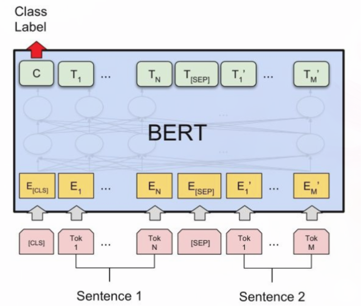
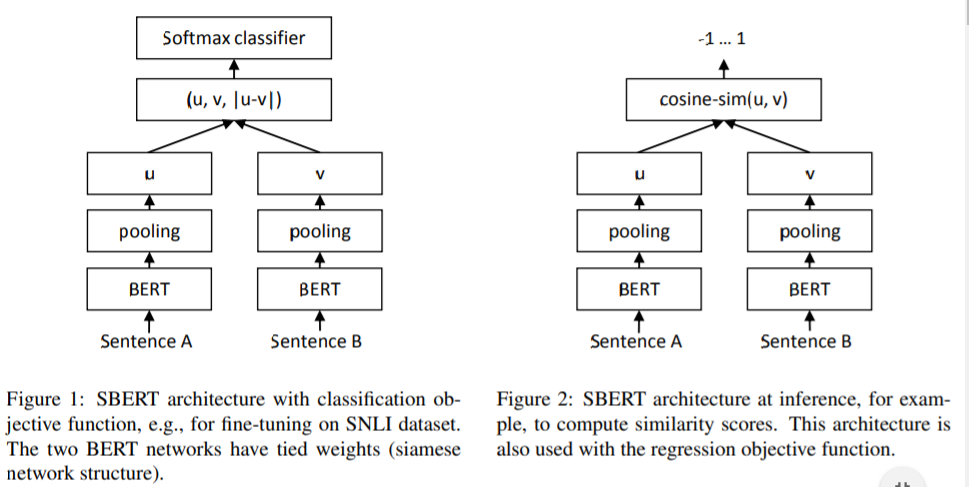
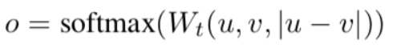
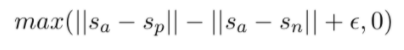
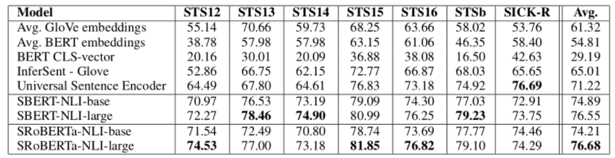

# Sentence-BERT: Sentence Embeddings using Siamese BERT-Networks

> 作者：杨夕
> 
> 项目地址：https://github.com/km1994/nlp_paper_study
> 
> 个人介绍：大佬们好，我叫杨夕，该项目主要是本人在研读顶会论文和复现经典论文过程中，所见、所思、所想、所闻，可能存在一些理解错误，希望大佬们多多指正。
> 
> 论文地址：chrome-extension://ikhdkkncnoglghljlkmcimlnlhkeamad/pdf-viewer/web/viewer.html?file=https%3A%2F%2Farxiv.org%2Fpdf%2F1908.10084.pdf

## 动机

- 方法一：BERT使用交叉编码器：将两个句子传递到变压器网络，并预测目标值；
  - 问题： 由于太多可能的组合，此设置不适用于各种对回归任务。 在n = 10000个句子的集合中找到相似度最高的对需要BERT n·（n-1）/ 2 = 49 995 000推理计算。 在现代V100 GPU上，这大约需要65个小时。 类似地，对于一个新问题，找到Quora的超过4,000万个现有问题中最相似的一个可以建模为与BERT的成对比较，但是，回答单个查询将需要50多个小时。

- 方法二：解决聚类和语义搜索的常用方法是将每个句子映射到向量空间，以使语义相似的句子接近。 研究人员已开始将单个句子输入BERT，并得出固定大小的句子嵌入。 最常用的方法是平均BERT输出层（称为BERT嵌入）或通过使用第一个令牌的输出（[CLS]令牌）；
  - 问题：就像我们将要展示的那样，这种常规做法产生的句子嵌入效果很差，通常比平均GloVe嵌入效果更差。

## 解决方法

为了缓解此问题，我们开发了SBERT。 siamese network 体系结构使得可以导出输入句子的固定大小矢量。 使用余弦相似度或Manhatten / Euclidean距离之类的相似度度量，可以找到语义上相似的句子。 这些相似性度量可以在现代硬件上非常高效地执行，从而允许SBERT用于语义相似性搜索以及聚类。 **在10,000个句子的集合中查找最相似的句子对的复杂性从使用BERT的65小时减少到计算10,000个句子嵌入（使用SBERT约为5秒）和计算余弦相似度（〜0.01秒）**。 通过**使用优化的索引结构**，可以将找到最相似的Quora问题从50小时减少到几毫秒。

## 方法介绍

### 对 BERT 的输出添加 三种 pooling operation

- Using the output of the CLS-token；
- computing the mean of all output vectors (MEANstrategy)；
- computing a max-over-time of theoutput vectors (MAX-strategy)

### 针对不同的任务，建立三种目标函数

- Classification Objective Function（上图左）

1. 获取到 两句话 的 句子向量 u 和 v；
2. 将 u  、v 和二者按位求差向量 |u-v| 进行拼接;
3. 拼接好的向量乘上一个可训练的权重 Wt;

> 权重 Wt: 
> n: 句子向量维度；
> k: 类别数；

- Regression Objective Function （上图右）

目标函数是MSE-loss，直接对两句话的句子向量  和  计算余弦相似度，然后计算。

- Triplet Objective Function

在这个目标函数下，将模型框架进行修改，将原来的两个输入，变成三个句子输入。给定一个锚定句 a ，一个肯定句 p和一个否定句 n ，模型通过使 p和a 的距离小于 n和a 的距离，来优化模型。使其目标函数o最小，即：

> || · ||代表的是两个样本的距离，本文采用的是欧氏距离; 
> S_a、S_p、S_n均为对应样本的sentence-Embedding。实验时，作者将超参数epsilon设为1.

## 实验结果

### 模型效果对比实验

> 如图2，以上为各个方法将输入句子转为sentence-vector后计算相似度，再计算相似度和实际结果之间的斯皮尔曼系数（结果乘以100）。从图中可见，SBERT的效果优于直接输入BERT。

### 消融实验

本实验检测了不同pooling方法和不同特征concat手段对结果的影响。最终发现，特征concat方式对结果有较大的影响，而pooling方法影响不大。特别的是，加上u*v这个特征后，效果反而会有所下降。

### 计算开销试验

该实验衡量了不同的句子Embedding生成方法的速度。从图中可以看出，在CPU上运行时，InferSent的速度比SBERT大约快65%；但切换到可并行的GPU后，transformer可并行的优势就显现出来，当SBERT采用聪明的batch size时，它的速度比InferSent快~9%。

