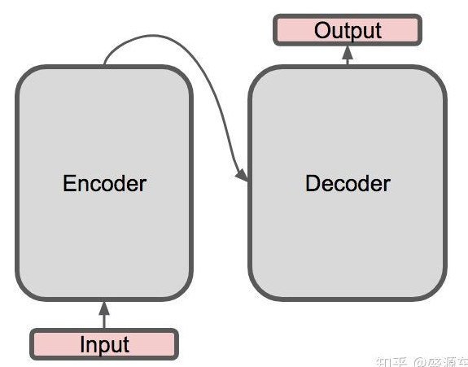
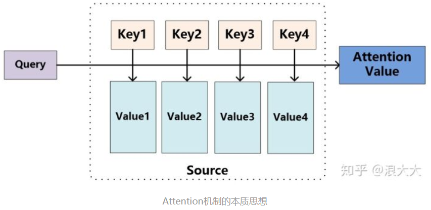
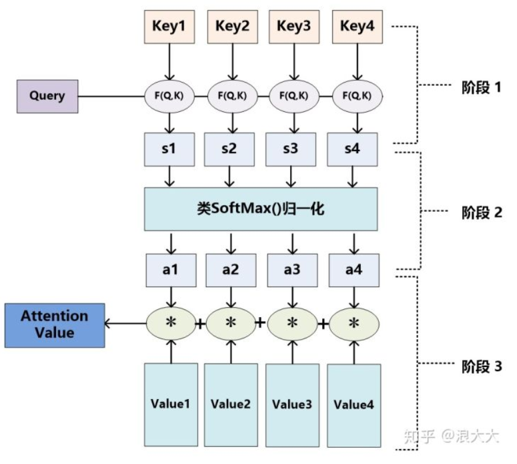
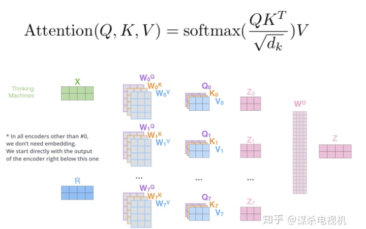
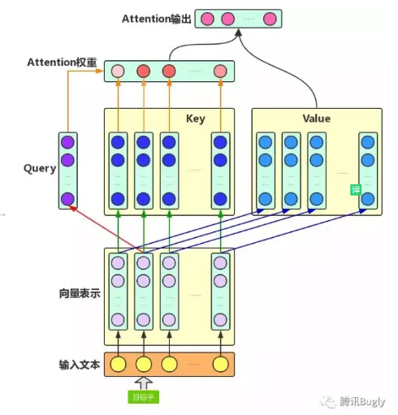
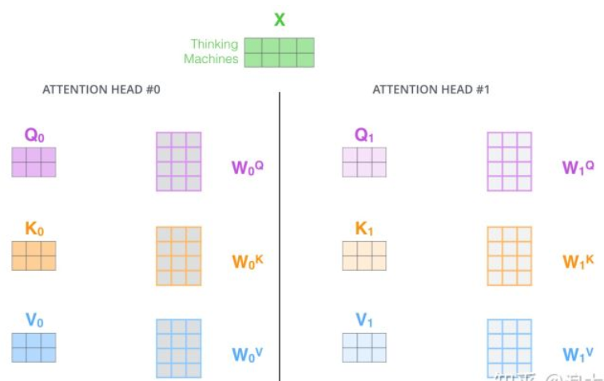
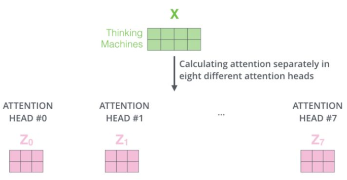
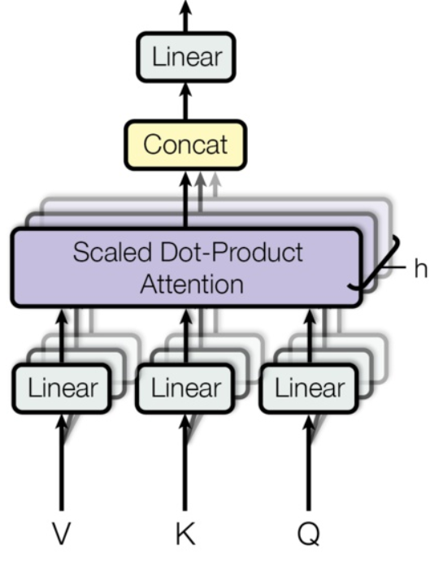
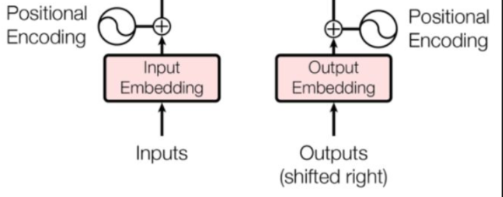

# 那些 【关于Transformer】 的你不知道的事

> 作者：小莫
> 
> 论文链接：https://arxiv.org/pdf/1706.03762.pdf
> 
> Github: https://github.com/tensorflow/tensor2tensor

## 引言

本博客 主要 是本人在学习 Transformer 时的**所遇、所思、所解**，通过以 **十二连问** 的方式帮助大家更好的理解 该问题。

## 十二连问

1. 为什么要有 Transformer?
2. Transformer 作用是什么？
3. Transformer 整体结构怎么样？
4. Transformer-encoder 结构怎么样？
5. Transformer-decoder 结构怎么样?
6. 传统 attention 是什么?
7. self-attention 长怎么样?
8. multi-head attention 怎么解?
9. 为什么要 加入 position embedding ？
10. 为什么要 加入 残差模块？
11. Layer normalization。Normalization 是什么?
12. 什么是 Mask？

## 问题解答

### 为什么要有 Transformer?

- RNN：能够捕获长距离依赖信息，但是无法并行；
- CNN: 能够并行，无法捕获长距离依赖信息（需要通过层叠 or 扩张卷积核 来 增大感受野）；
- 传统 Attention
  - 方法：基于源端和目标端的隐向量计算Attention，
  - 结果：源端每个词与目标端每个词间的依赖关系 【源端->目标端】
  - 问题：忽略了 远端或目标端 词与词间 的依赖关系

### Transformer 作用是什么？

基于Transformer的架构主要用于建模语言理解任务，它避免了在神经网络中使用递归，而是完全依赖于self-attention机制来绘制输入和输出之间的全局依赖关系。

### Transformer 整体结构怎么样？

1. 整体结构

Transformer 整体结构 为 encoder-decoder 结构

2. 整体结构放大一点
   
encoder有6层，每一层里面有2个子层；decoder也是有6层，每一层里面有3个子层

3. 整体结构再放大一点
   
其中每一层的内部结构如下图所求。上图左边的每一层encoder都是下图左边的结构。上图右边的每一层的decoder都是下图右边的结构

### Transformer-encoder 结构怎么样？

- 特点：
  - 与 RNN,CNN 类似，可以当成一个特征提取器；
- 组成结构介绍
  - embedding 层：将 input 转化为 embedding 向量 $X$；
  - Position encodding: input的位置与 input 的 embedding $X$ 相加 得到 向量 $X$；
  - self-attention : 将融合input的位置信息 与 input 的 embedding 信息的 $X$ 输入 Self-Attention 层得到 $Z$;
  - 残差网络：$Z$ 与 $X$ 相加后经过 layernorm 层；
  - 前馈网络：经过一层前馈网络以及 Add&Normalize，（线性转换+relu+线性转换 如下式）
  

- 举例说明（假设序列长度固定，如100，如输入的序列是“我爱中国”）：
  - 首先需要 **encoding**：
    - 将词映射成一个数字，encoding后，由于序列不足固定长度，因此需要padding，
    - 然后输入 embedding层，假设embedding的维度是128，则输入的序列维度就是100*128；
  - 接着是**Position encodding**，论文中是直接将每个位置通过cos-sin函数进行映射；
    - 分析：这部分不需要在网络中进行训练，因为它是固定。但现在很多论文是将这块也embedding，如bert的模型，至于是encoding还是embedding可取决于语料的大小，语料足够大就用embedding。将位置信息也映射到128维与上一步的embedding相加，输出100*128
  - 经过**self-attention层**：
    - 操作：假设v的向量最后一维是64维(假设没有多头)，该部分输出100*64；
  - 经过残差网络：
    - 操作：即序列的embedding向量与上一步self-attention的向量加总；
  - 经过 **layer-norm**：
    - 原因：
      - 由于在self-attention里面更好操作而已；
      - 真实序列的长度一直在变化；
  - 经过 **前馈网络**：
    - 目的：增加非线性的表达能力，毕竟之前的结构基本都是简单的矩阵乘法。若前馈网络的隐向量是512维，则结构最后输出100*512；

### Transformer-decoder 结构怎么样?

- 特点：与 encoder 类似
- 组成结构介绍
  - masked 层：
    - 目的：确保了位置 i 的预测仅依赖于小于 i 的位置处的已知输出;
  - Linear layer：
    - 目的：将由解码器堆栈产生的向量投影到一个更大的向量中，称为对数向量。这个向量对应着模型的输出词汇表；向量中的每个值，对应着词汇表中每个单词的得分；
  - softmax层:
    - 操作：这些分数转换为概率（所有正数，都加起来为1.0）。选择具有最高概率的单元，并且将与其相关联的单词作为该时间步的输出

### 传统 attention 是什么?

- 思路
  - 输入 给定 Target 中某个 query；
  - 计算权值 Score：
    - 计算 query 和 各个 Key 的相似度或相关性，得到每个 Key 对应 value 的权值系数；
  - 对 权值 Score 和 value 进行加权求和
- 核心：
  - Attention 机制 是对 source 中各个元素 的 value 进行加权求和，而 query 和 key 用于计算 对应 value 的权值系数

> $L_x=||Source||$代表Source的长度

- 概念：
  - attention 的核心 就是从 大量信息中 筛选出少量的 重要信息；
  - 具体操作：每个 value 的 权值系数，代表 其 重要度； 
  

- 具体流程介绍
  - step 1：计算权值系数
    - 采用 不同的函数或计算方式，对 query 和 key 进行计算，求出相似度或相关性
    - 采用的计算方法：
      - 向量点积：
        - $$Sim(query,key_i) = query · Key_i$$
      - Cosine 相似度计算：
        - $$\text { Similarity (Query, }\left.\boldsymbol{K e} \boldsymbol{y}_{\boldsymbol{i}}\right)=\frac{\text { Query. } \boldsymbol{K e y}_{\boldsymbol{i}}}{\| Q \text {uery}\|\cdot\| \boldsymbol{K} \boldsymbol{e} \boldsymbol{y}_{\boldsymbol{i}} \|}$$
      - MLP 网络：
        - $Sim(query,key_i) = MLP(query,key_i)$
  - step 2: softmax 归一化
    - 原因：
      - 1. score 值分布过散，将原始计算分值整理成所有元素权重之和为1 的概率分布；
      - 2. 可以通过SoftMax的内在机制更加突出重要元素的权重；
    - 公式介绍

  - step 3: 加权求和
    - 公式介绍：
      - 计算结果 $a_i$ 即为 $value_i$ 对应的权重系数，然后进行加权求和即可得到Attention数值

- 存在问题
  - 忽略了 远端或目标端 词与词间 的依赖关系

### self-attention 长怎么样?

- 动机
  -  RNN 所存在的无法并行化问题；
  -  CNN 所存在的长距离依赖问题；
- 传统 Attention
  - 方法：基于源端和目标端的隐向量计算Attention，
  - 结果：源端每个词与目标端每个词间的依赖关系 【源端->目标端】
  - 问题：忽略了 远端或目标端 词与词间 的依赖关系
- 核心思想：self-attention的结构在计算每个token时，总是会考虑整个序列其他token的表达；
  - 举例：“我爱中国”这个序列，在计算"我"这个词的时候，不但会考虑词本身的embedding，也同时会考虑其他词对这个词的影响
- 目的：学习句子内部的词依赖关系，捕获句子的内部结构。

- 步骤
  - embedding层：
    - 目的：将词转化成embedding向量；
  - q,k,v 向量计算：
    - 根据 embedding 和权重矩阵，得到q,k,v；
      - q：查询向量，目标字作为 Query；
      - k: 键向量，其上下文的各个字作为 Key；
      - v: 值向量，上下文各个字的 Value；
  - 权重 score 计算：
    - 查询向量 query 点乘 key;
    - 目的：计算其他词对这个词的重要性，也就是权值；
  - scale 操作：
    - 权重 score 进行scale；
    - 目的：为了防止其结果过大；
  - softmax 归一化：
    - 经过softmax归一化；
  - Attention 的输出计算：
    - 权值 score 和各个上下文字的 Value 向量 的加权求和
    - 目的：把上下文各个字的 Value 融入目标字的原始 Value 中
- 举例
  - 答案就是文章中的q、k、v，这三个向量都可以表示"我"这个词，但每个向量的作用并不一样，q 代表query，当计算"我"这个词时，它就能代表"我"去和其他词的 k 进行点乘计算其他词对这个词的重要性，所以此时其他词(包括自己)使用 k 也就是 key 代表自己，当计算完点乘后，我们只是得到了每个词对“我”这个词的权重，需要再乘以一个其他词(包括自己)的向量，也就是v(value)，才完成"我"这个词的计算，同时也是完成了用其他词来表征"我"的一个过程

- 优点
  - 捕获源端和目标端词与词间的依赖关系
  - 捕获源端或目标端自身词与词间的依赖关系

- 问题讨论
  - 为什么 要 进行 Scale 操作，也就是除以 $\sqrt{d_{k}}$?
    - 原因：多除了一个 $\sqrt{d_{k}}$ 起到调节作用，使得内积不至于太大。

### multi-head attention 怎么解?

- 思路：
  - 相当于 $h$ 个 不同的 self-attention 的集成
  - 就是把self-attention做 n 次，取决于 head 的个数；论文里面是做了8次。
- 步骤：
  - step 1 : 初始化 N 组 $Q，K，V$矩阵(论文为 8组)；
  

  - step 2 : 每组 分别 进行 self-attention;

  - step 3：
    - 问题：多个 self-attention 会得到 多个 矩阵，但是前馈神经网络没法输入8个矩阵；
    - 目标：把8个矩阵降为1个
    - 步骤：
      - 每次self-attention都会得到一个 Z 矩阵，把每个 Z 矩阵拼接起来，
      - 再乘以一个Wo矩阵，
      - 得到一个最终的矩阵，即 multi-head attention 的结果；

最后，让我们来看一下完整的流程：

- 动图介绍

### 为什么要 加入 position embedding ？

- 问题：
  - 介绍：缺乏 一种 表示 输入序列中 单词顺序 的方法
  - 说明：因为模型不包括Recurrence/Convolution，因此是无法捕捉到序列顺序信息的，例如将K、V按行进行打乱，那么Attention之后的结果是一样的。但是序列信息非常重要，代表着全局的结构，因此必须将序列的分词相对或者绝对position信息利用起来
- 目的：attention 就可以分辨出不同位置的词
- 思路：
  - 在 encoder 层和 decoder 层的输入添加了一个额外的向量Positional Encoding，维度和embedding的维度一样，让模型学习到这个值
- 位置向量的作用：
  - 决定当前词的位置；
  - 计算在一个句子中不同的词之间的距离
- 步骤：
  - 将每个位置编号，
  - 然后每个编号对应一个向量，
  - 通过将位置向量和词向量相加，就给每个词都引入了一定的位置信息。

- 论文的位置编码是使用三角函数去计算的。好处：
  - 值域只有[-1,1]
  - 容易计算相对位置。

> 注：
> 
> $pos$ 表示当前词在句子中的位置
> 
> $i$ 表示向量中每个值 的 index
> 
> 在偶数位置：使用 正弦编码 $sin()$;
> 
> 在奇数位置：使用 余弦编码 $cos()$;

### 为什么要 加入 残差模块？

- 动机：因为 transformer 堆叠了 很多层，容易 梯度消失或者梯度爆炸

### Layer normalization。Normalization 是什么?

- 动机：因为 transformer 堆叠了 很多层，容易 梯度消失或者梯度爆炸；
- 原因：
  - 数据经过该网络层的作用后，不再是归一化，偏差会越来越大，所以需要将 数据 重新 做归一化处理；
- 目的：
  - 在数据送入激活函数之前进行normalization（归一化）之前，需要将输入的信息利用 normalization 转化成均值为0方差为1的数据，避免因输入数据落在激活函数的饱和区而出现 梯度消失或者梯度爆炸 问题
- 介绍：
  - 归一化的一种方式
  - 对每一个样本介绍均值和方差【这个与 BN 有所不同，因为他是在 批方向上 计算均值和方差】
- 公式
  

  > BN 计算公式

  > LN 计算公式

### 什么是 Mask？

- 介绍：掩盖某些值的信息，让模型信息不到该信息；
- 类别：padding mask and sequence mask
  - padding mask
    - 作用域：每一个 scaled dot-product attention 中
    - 动机：
      - 输入句子的长度不一问题
    - 方法：
      - 短句子：后面 采用 0 填充
      - 长句子：只截取 左边 部分内容，其他的丢弃
    - 原因：
      - 对于 填充 的位置，其所包含的信息量 对于 模型学习 作用不大，所以 self-attention 应该 抛弃对这些位置 进行学习；
    - 做法：
      - 在这些位置上加上 一个 非常大 的负数（负无穷），使 该位置的值经过 softmax 后，值近似 0，利用 padding mask 标记哪些值需要做处理；
  - sequence mask
    - 作用域：只作用于 decoder 的 self-attention 中
    - 动机：不可预测性；
    - 目标：sequence mask 是为了使得 decoder 不能看见未来的信息。也就是对于一个序列，在 time_step 为 t 的时刻，我们的解码输出应该只能依赖于 t 时刻之前的输出，而不能依赖 t 之后的输出。因此我们需要想一个办法，把 t 之后的信息给隐藏起来。
    - 做法：
      - 产生一个上三角矩阵，上三角的值全为0。把这个矩阵作用在每一个序列上，就可以达到我们的目的
> 注：
> 
> 在 decoder 的 scaled dot-product attention 中，里面的 attn_mask = padding mask + sequence mask
> 
> 在 encoder 的 scaled dot-product attention 中，里面的 attn_mask = padding mask

## 参考资料

1. [《Attention is All You Need》浅读（简介+代码）](https://kexue.fm/archives/4765)
2. [论文笔记：Attention is all you need（Transformer）](https://zhuanlan.zhihu.com/p/51089880)
3. [深度学习-论文阅读-Transformer-20191117](https://zhuanlan.zhihu.com/p/92234185)
4. [Transform详解(超详细) Attention is all you need论文](https://zhuanlan.zhihu.com/p/63191028)

