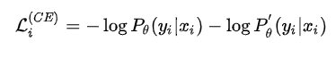
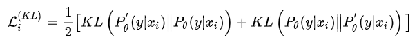

# 【关于 R-Drop】 那些你不知道的事

> 作者：杨夕
> 
> 论文：R-Drop: Regularized Dropout for Neural Networks
> 
> 会议： 
> 
> 论文下载地址：https://arxiv.org/abs/2106.14448
> 
> 论文代码：https://github.com/dropreg/R-Drop
> 
> 本文链接：https://github.com/km1994/nlp_paper_study
> 
> 个人介绍：大佬们好，我叫杨夕，该项目主要是本人在研读顶会论文和复现经典论文过程中，所见、所思、所想、所闻，可能存在一些理解错误，希望大佬们多多指正。
> 
> 【注：手机阅读可能图片打不开！！！】

- [【关于 R-Drop】 那些你不知道的事](#关于-r-drop-那些你不知道的事)
  - [一、摘要](#一摘要)
  - [二、Dropout 介绍](#二dropout-介绍)
  - [三、R-Drop（Regularized Dropout） 方法简介](#三r-dropregularized-dropout-方法简介)
  - [四、R-Drop（Regularized Dropout） 方法动机](#四r-dropregularized-dropout-方法动机)
  - [五、R-Drop（Regularized Dropout） 方法核心思想](#五r-dropregularized-dropout-方法核心思想)
  - [参考](#参考)

## 一、摘要

- 介绍：Dropout 是一种强大且广泛使用的技术，用于规范深度神经网络的训练。
- 论文方法：在本文中，我们在模型训练中引入了一种简单的 dropout 正则化策略，即 R-Drop，它强制 dropout 生成的不同子模型的输出分布相互一致。具体来说，对于每个训练样本，R-Drop 最小化了通过 dropout 采样的两个子模型的输出分布之间的双向 KL 散度。
- 实验结论：理论分析表明，R-Drop 降低了模型参数的自由度并补充了 dropout。
- 实验结果：在神经机器翻译、摘要、语言理解、语言建模和图像分类等 5 个广泛使用的深度学习任务（共 18 个数据集）上的实验表明，R-Drop 具有普遍性。特别是，当应用于微调大规模预训练模型（例如 ViT、RoBERTa-large 和 BART）时，它产生了实质性的改进，并使用 vanilla Transformer 模型实现了最先进的 (SOTA) 性能在 WMT14 英语→德语翻译 (30.91 BLEU) 和 WMT14 英语→法语翻译 (43.95 BLEU) 上，甚至超过了使用超大规模数据训练的模型和专家设计的 Transformer 模型的高级变体。

## 二、Dropout 介绍

- 介绍：由于深度神经网络非常容易过拟合，因此 Dropout 方法采用了随机丢弃每层的部分神经元，以此来避免在训练过程中的过拟合问题。同时提升模型的泛化（generalization）能力。
- 方法：Dropout 需要简单地在训练过程中丢弃一部分的神经元

## 三、R-Drop（Regularized Dropout） 方法简介

- 介绍：与传统作用于神经元（Dropout）或者模型参数（DropConnect）上的约束方法不同，R-Drop **作用于模型的输出层**，弥补了 Dropout 在训练和测试时的不一致性。简单来说就是在每个 mini-batch 中，**每个数据样本过两次带有 Dropout 的同一个模型，R-Drop 再使用 KL-divergence 约束两次的输出一致**。
- 作用：**R-Drop 约束了由于 Dropout 带来的两个随机子模型的输出一致性**。

## 四、R-Drop（Regularized Dropout） 方法动机

由于深度神经网络非常容易过拟合，因此 Dropout 方法采用了随机丢弃每层的部分神经元，以此来避免在训练过程中的过拟合问题。**正是因为每次随机丢弃部分神经元，导致每次丢弃后产生的子模型都不一样，所以 Dropout 的操作一定程度上使得训练后的模型是一种多个子模型的组合约束。**基于 Dropout 的这种特殊方式对网络带来的随机性，研究员们提出了 R-Drop 来进一步对（子模型）网络的输出预测进行了正则约束。

## 五、R-Drop（Regularized Dropout） 方法核心思想

论文通过对模型进行两次 Dropout 之后，会得到两个 不同的模型：

此时，模型的 Loss 包含 交叉熵 Loss 和 KL 散度 Loss 两部分：

- 交叉熵 Loss

- KL 散度 Loss

> 该损失函数的作用是让不同的 Dropout 的模型尽可能一致

- 交叉熵 Loss 和 KL 散度 Loss 加权

> 其中 α 为超参数根据自己的任务需要调整不同的参数来应对

在实际实现中，数据 $x_i$ 不需要过两次模型，而只需要把 $x_i$ 在同一个 batch 中复制一份即可。直观地说，在训练时，Dropout 希望每一个子模型的输出都接近真实的分布，然而在测试时，Dropout 关闭使得模型仅在参数空间上进行了平均，因此训练和测试存在不一致性。而 R-Drop 则在训练过程中通过刻意对于子模型之间的输出进行约束，来约束参数空间，让不同的输出都能一致，从而降低了训练和测试的不一致性。另外，研究员们还从理论的角度出发，阐述了 R-Drop 的约束项对于模型自由度的控制，从而更好地提升模型的泛化性能。

## 参考

1. [R-Drop: Regularized Dropout for Neural Networks](https://github.com/dropreg/R-Drop)
2. [又是Dropout两次！这次它做到了有监督任务的SOTA](https://kexue.fm/archives/8496#R-Drop)
3. [提升泛化能力的R-drop在NER中的实验](https://zhuanlan.zhihu.com/p/385796959)