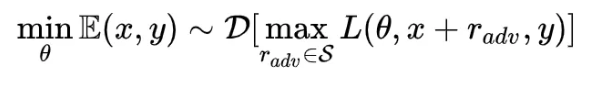

# 【关于 FreeLB 】 那些的你不知道的事

> 作者：杨夕
> 
> 论文名称: FreeLB: Enhanced Adversarial Training for Language Understanding 加强语言理解的对抗性训练
> 
> 项目地址：https://github.com/km1994/nlp_paper_study
> 
> 【注：手机阅读可能图片打不开！！！】
> 
> 个人介绍：大佬们好，我叫杨夕，该项目主要是本人在研读顶会论文和复现经典论文过程中，所见、所思、所想、所闻，可能存在一些理解错误，希望大佬们多多指正。

## Abstract

Adversarial training, which minimizes the maximal risk for label-preserving input perturbations, has proved to be effective for improving the generalization of language models. In this work, we propose a novel adversarial training algorithm - FreeLB, that promotes higher robustness and invariance in the embedding space, by adding adversarial perturbations to word embeddings and minimizing the resultant adversarial risk inside different regions around input samples. To validate the effectiveness of the proposed approach, we apply it to Transformer-based models for natural language understanding and commonsense reasoning tasks. Experiments on the GLUE benchmark show that when applied only to the finetuning stage, it is able to improve the overall test scores of BERT-based model from 78.3 to 79.4, and RoBERTa-large model from 88.5 to 88.8. In addition, the proposed approach achieves state-of-the-art test accuracies of 85.39% and 67.32% on ARC-Easy and ARC-Challenge. Experiments on CommonsenseQA benchmark further demonstrate that FreeLB can be generalized and boost the performance of RoBERTa-large model on other tasks as well.

对抗训练使保留标签的输入扰动的最大风险最小，对于提高语言模型的泛化能力是有效的。 

在这项工作中，我们提出了一种新的对抗性训练算法—— freeb，它通过在字嵌入中添加对抗性的干扰，最小化输入样本周围不同区域内的对抗性风险，从而提高嵌入空间的鲁棒性和不变性。 

为了验证该方法的有效性，我们将其应用到基于 transformer 的自然语言理解模型和常识推理任务中。 Glue 基准测试的实验结果表明，当仅应用于细化阶段时，它能够将基于 bert 模型的总体测试分数从78.3提高到79.4，并将 RoBERTa-large 模型的总体测试分数从88.5提高到88.8。 此外，该方法在 arceasy 和 ARC-Challenge 上分别实现了85.39% 和67.32% 的最新测试准确率。 Commonsenseqa 基准测试的实验进一步证明，freeb 可以被广义化，并且可以提高 RoBERTa-large 模型在其他任务上的性能。

## 对抗训练介绍

对抗性训练是一种创建健壮神经网络的方法。 在对抗性训练期间，小批量的训练样本受到对抗性扰动的污染(这些扰动很小，但会导致错误分类) ，然后用于更新网络参数，直到最终的模型学会抵抗这种攻击。 对抗性训练最初是作为提高机器学习系统(43405)安全性的一种手段而提出的，特别是对于安全关键系统，如自动驾驶汽车(Xiao 2018 eccv)和版权检测(saadatpanah2019 adversal)。

## 方法提出

本文展示对抗性训练对于许多语言理解任务来说，显著地提高了最先进模型的性能。 特别是，提出了一种新的对抗性训练算法，称为 freeb (Free Large-Batch) ，它给单词嵌入增加了对抗性干扰，并将输入样本周围的对抗性损失降到最低。 该方法利用最近提出的“full” 训练策略 ，在不同的标准约束下使用多样化的对抗性样本来扩大批量，而且不会比基于 pgd (预测梯度下降法)的对抗性培训(madry2018towards)增加额外的成本，这使我们能够在大规模的最先进的模型上进行这种多样化的对抗性培训。 我们观察到用 freeb 训练的模型在嵌入空间中的鲁棒性和不变性得到了改善，并且与泛化成正相关。

## ADVERSARIAL TRAINING FOR LANGUAGE UNDERSTANDING

### Min-Max公式

该公式分为两个部分，一个是内部损失函数的最大化，一个是外部经验风险的最小化。 

1. 内部 max 是为了找到 worst-case 的扰动，也就是攻击，其中，L 为损失函数，S 为扰动的范围空间。 

2. 外部 min 是为了基于该攻击方式，找到最鲁棒的模型参数，也就是防御，其中 D 是输入样本的分布。 

公式简单清晰地定义了对抗样本攻防“矛与盾”的两个问题：如何构造足够强的对抗样本？以及，如何使模型变得刀枪不入？剩下的，就是如何求解的问题了。

## 对抗训练的作用

一是提高模型对恶意攻击的鲁棒性；

二是提高模型的泛化能力。

在 CV 任务，根据经验性的结论，对抗训练往往会使得模型在非对抗样本上的表现变差，然而神奇的是，在 NLP 任务中，模型的泛化能力反而变强了。

在 NLP 任务中，对抗训练的角色不再是为了防御基于梯度的恶意攻击，反而更多的是作为一种 regularization，提高模型的泛化能力。

## 结论

开发了一种对抗性的训练方法 freeb，以提高自然语言的理解能力。 该方法采用梯度方法对连续的词嵌入进行干扰，有效地最小化了结果的对抗性风险。 Freelb 能够在多个数据集上增强基于 transformer 的模型(BERT 和 RoBERTa) ，并在 GLUE 和 ARC 基准测试上达到新的水平。 