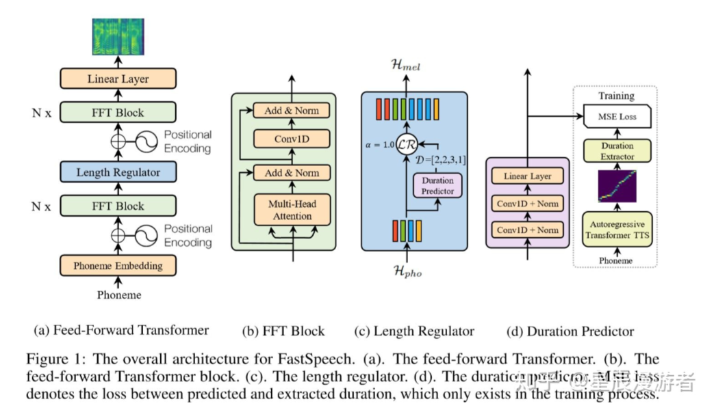

# 【关于 FastSpeech】那些你不知道的事

> 论文名称：FastSpeech: Fast, Robust and Controllable Text to Speech
> 
> 论文地址：https://arxiv.org/abs/1905.09263

## 一、论文动机

论文首先指出了端到端自回归（Auto Regressive）的语音合成系统存在的问题：

1. **推理阶段速度过慢**（traditional Transformer虽然训练的速度很快，但是推理阶段仍然需要上一时间步的输出，无法做到真正的并行）；
2. **生成的语音不是鲁棒的，有一些单词会被跳过或者重复地生成**（这一点笔者在实验的时候真的是深有体会啊，而造成这一原因主要是因为传统语音合成系统的Alignment是隐式的，在推断的过程中，存在着错误对齐的情况）；
3. **无法做到可控**（这里笔者的可控应该主要指的是生成的语速方面，因为在Prosody的层面已经有工作做到了很好的效果）。

## 二、论文方法

论文针对上述三个问题，基于Transformer，重新设计了模型。模型的示意图如下：

1. Feed-Forward Transformer(图a): 输入音素序列，然后经过N个FFT Block的处理后通过length regulator来预测音素对应的mel-spec的长度，之后再经过N个FFT Block后输出mel-spec;
2. FFT Block(图b): 基本和一般的Transformer类似，利用了multi-head attention和layer norm，稍微有点不同的是作者这里使用了1D卷积，而不是普通的全连接神经网络;
3. Length Regulator(图c)：
   1. 动机：由于mel-spec的长度要远远大于输入的音素的长度，仅仅利用self-attention是无法解决这个问题的
   2. 方法：定义一个音素对应的mel-spec的frame数为phoneme duration（日语中称为音素持续长）。假设每个音素的phoneme duration是已知的，且设为d，length regulator首先将每个音素对应的state复制d次，这样状态的数量就和输出mel-spec的frame是相等的
4. Duration Predictor（图d）: 
   1. 动机：实际上在训练的时候这个值虽然已知，但在合成语音的时候它却是未知的，因此我们需要一个duration predictor来预测这个值
   2. 思路：
      1. 首先用训练一个auto-regressive的TTS模型，这个时候我们不需要知道phoneme duration。
      2. 接下来我们用这个TTS模型来为每个训练数据对儿生成attention alignmen

## 参考

1. [FastSpeech阅读笔记](https://zhuanlan.zhihu.com/p/67325775)
2. [FastSpeech——高速end-to-end语音合成](https://zhuanlan.zhihu.com/p/362716246)

