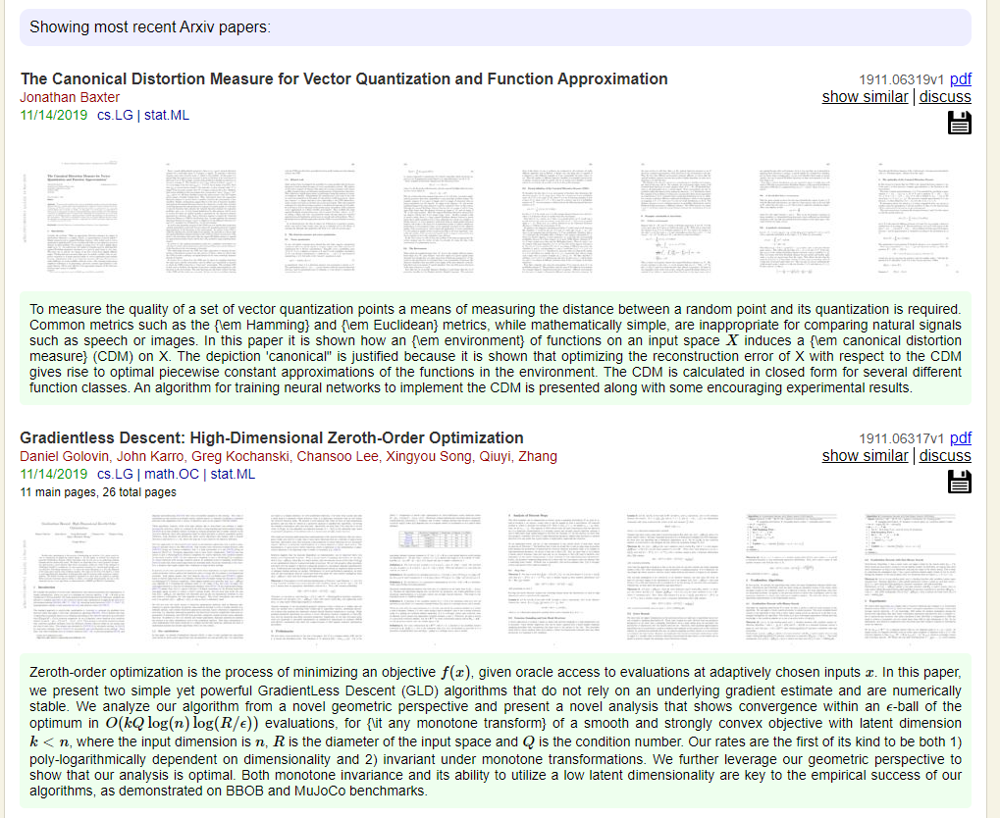
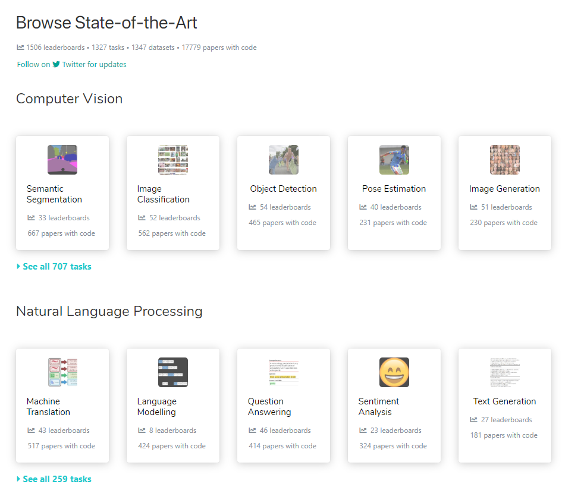
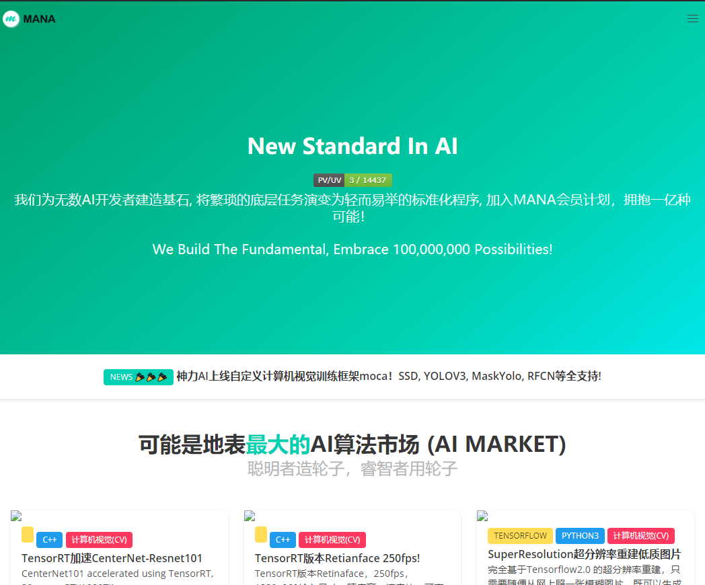
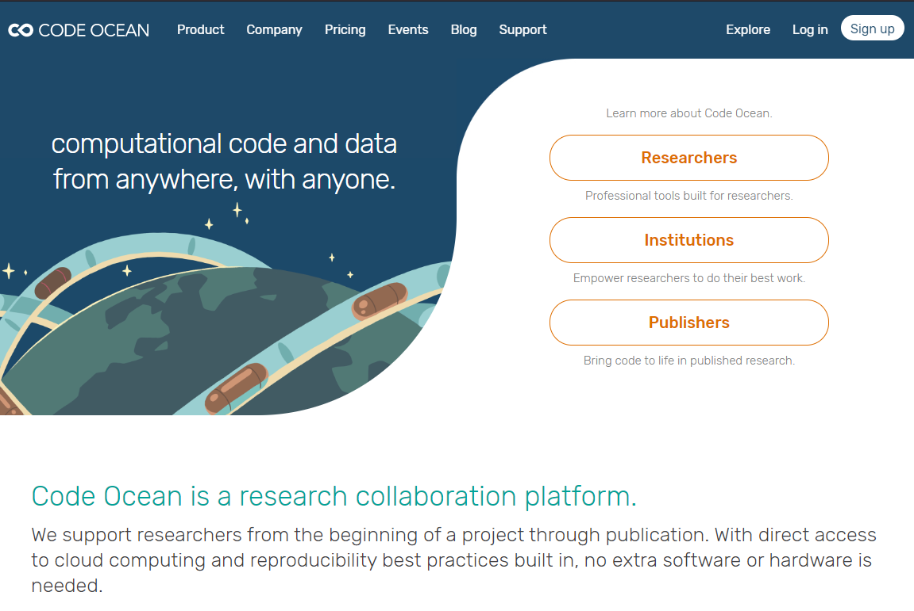
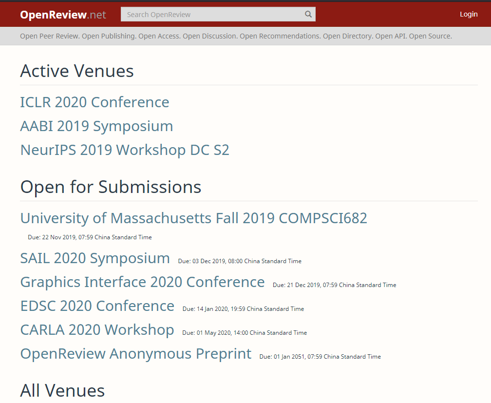

# 论文学习方法

分享人：Yang，阿良哥，辉哥

## 论文不会找怎么办？

### 顶会资讯

一般不同方向都有该方向对应的顶会论文。

1. 机器学习(Machine Learning)百花齐放系列:

    机器学习作为人工智能的一个分支，涉及到概率论、统计学、计算复杂性理论等多门学科，目的是让计算机能像人一样自动学习，从而不断完善自身性能。机器学习的技术更新可广泛应用于计算机视觉、自然语言处理、搜索引擎、数据挖掘等领域。机器学习领域主要有两大国际会议最具影响力，分别是ICML和NIPS。

 - [ICML](https://icml.cc/Conferences/2019/) 

    ICML：International Conference on Machine Learning

    国际机器学习大会，由IMLS国际机器学习协会支持，始于1980年，此后每年夏季举行，2014年举办地在北京。ICML会接收到各路机器学习大牛的投稿，录用率只有百分之二十多。第36届ICML将于2019年6月10日到15日在美国长滩举办。

 - [NIPS](https://neurips.cc/Conferences/2019) 

    NIPS：Neural Information Processing Systems

    神经信息处理系统会议由NIPS基金会主办，固定在每年12月举行，是机器学习和计算神经科学领域的顶级会议，最初是为研究生物和人造神经网络的研究者设计的交叉学科会议，所以早期的会议主题既包括如何解决纯粹的工程问题，也包括利用机器模型理解生物神经网络。

    后来生物系统的研究和人造系统的研究分道扬镳，NIPS的会议主题就主要集中在了机器学习、人工智能和统计学上。

2. AI人工智能顶会系列:

 - [AAAI](https://aaai.org/Conferences/AAAI-19/) 

    AAAI: AAAI Conference on Artificial Intelligence

    AAAI会议由人工智能促进协会AAAI（Association for the Advancement of Artificial Intelligence）主办。人工智能促进协会是一个国际化的非营利科学组织，旨在推动人工智能领域的研究和应用，增进大众对人工智能的了解。AAAI会议始于1980年，既注重理论，也注重应用，还会讨论对人工智能发展有着重要影响的社会、哲学、经济等话题。

 - [IJCAI](https://ijcai19.org/) 

    IJCAI: International Joint Conferences on AI

    IJCAI是一家1969年于美国加州成立的非营利企业，致力于推动科学和教育的发展，由负责会议和期刊的两个部分组成。IJCAI会议始于1969年，每两年举办一次，从2016年开始改为一年举办一次。IJCAI会议选拔要求非常严格，论文录取率几乎不超过26%，2011年录取率仅17%。

    IJCAI每年会评选多个奖项，包含嘉奖人工智能领域杰出年轻科学家的IJCAI Computers and Thought Award、针对在职业生涯中为人工智能领域做出突出贡献和服务的高级科学家的Donald E. Walker Distinguished Service Award、面向进行了连续性高质量研究并取得实质性成果的科学家的IJCAI Award for Research Excellence以及若干最佳论文奖。

3. NLP领域的四大金刚系列:

 - [ACL](https://www.aclweb.org/portal/) 

    ACL: Association of Computational Linguistics

    计算语言学协会是处理自然语言和计算问题的国际专业协会，成立于1962年，最初名为机器翻译和计算语言协会，于1968年更名为计算语言学协会。ACL每年选择不同的地点，一般在夏天举办年度会议，2015年第53届ACL年会在北京举办。2019年7月28日到8月2日第57届ACL会议将于意大利佛罗伦萨举办。

 - [NAACL-HLT](http://naacl.org/) 

    NAACL-HLT: Annual Conference of the North American Chapter of the Association for Computational Linguistics : Human Language Technologies

    ACL有一个欧洲分会（EACL）和一个北美分会（NAACL）。NAACL-HLT即是这个北美分会，一般简称为NAACL，HLT是强调对人类语言技术的专注和重视。虽然作为分会，但NAACL在自然语言处理领域也是当之无愧的顶级会议，每年选择在一个北美城市召开会议。2019年NAACL会议将于6月2日到7日在美国明尼阿波利斯举办。

 - [EMNLP](https://www.aclweb.org) 

    EMNLP: Empirical Methods in Natural Language Processing

    EMNLP由ACL当中对语言数据和经验方法有特殊兴趣的团体主办，始于1996年。2019年EMNLP会议将会于11月3日到7日于香港亚洲世博会举办。关于论文接收等会议信息可以在ACL2019的网站中查询。

 - [COLING](https://www.sheffield.ac.uk/dcs/research/groups/nlp/iccl/index#tab00) 

    COLING: International Conference on Computational Linguistics

    前三个会议都是ACL主办，这个终于不是了，但是为什么名字和全称完全不对应呢？原来这个会议始于1965年，是由ICCL国际计算语言学委员会（International Committee on Computational Linguistics）主办，自从第三届会议在斯德哥尔摩举办之后，这个会议就有了一个简称COLING，是谐音瑞典著名作家 Albert Engström小说中的虚构人物Kolingen。所以COLING一词和其代表的计算语言学国际会议在字面上并不对应。

3. CV 领域的三剑客系列:

 - [ICCV](http://iccv2019.thecvf.com/submission/timeline) 

    ICCV: International Conference on Computer Vision

    国际计算机视觉会议是由IEEE主办，通常持续4到5天，第1天由特定领域的顶尖专家进行指导讲座，接下来是技术会议和海报展示。ICCV会议设立了多个计算机视觉领域重量级的奖项，例如Azriel Rosenfeld Liftetime Achievement Award以计算机科学家和数学家Azriel Rosenfeld命名，每两年颁布一次，奖励在职业生涯中对计算机视觉做出突出贡献的研究者。每年会议中的最佳论文会被授予Marr Prize，是计算机视觉研究者的最高荣誉之一。

 - [CVPR](http://cvpr2019.thecvf.com/) 

    CVPR: Conference on Computer Vision and Pattern Recognition

    CVPR最初由IEEE计算机协会主办，2012年之后由IEEE计算机协会和CVF计算机视觉基金会联合主办，每年都会列出一张明确的主题清单，包含了众多专题研讨会和辅导课。CVPR采用多层级双盲评审流程，一篇论文要先后经过不少于3个评审员、数个区域主席、数个项目主席的评审，论文录取率小于30%，口头报告的录取率小于5%。

    CVPR也设置了数个奖项，包括CVPR Best Paper Award, Longuet-Higgins Prize以及PAMI Young Researcher Award等。

 - [ECCV](https://eccv2020.eu/) 

    ECCV: European Conference on Computer Vision

    欧洲计算机视觉国际会议每两年举办一次，包含辅导课、技术分享和海报展示，收录的论文主要来自于欧洲和美国的顶尖实验室或研究所。

### 论文搜索和分析工具

#### Google scholar

##### 介绍

##### 相关链接

1. [Google scholar](https://scholar.google.co.il/)

##### 效果图

#### Semantic scholar

##### 介绍

##### 相关链接

1. [Semantic scholar](https://www.semanticscholar.org/)

##### 效果图

#### 计算机视觉方面的论文

##### 介绍

记录每天整理的计算机视觉/深度学习/机器学习相关方向的论文

##### 相关链接

1. [计算机视觉方面的论文](https://github.com/amusi/daily-paper-computer-vision)

##### 效果图

#### Deep Learning Monitor

##### 介绍

##### 相关链接

1. [Deep Learning Monitor](https://deeplearn.org/)

##### 效果图

## 外文读不懂怎么办？

### arXiv-sanity

#### 介绍

相比于 arXiv 有很大的改进，包括在浏览中显示摘要、评论和非常基本的社交、库功能。这个整合了很多便捷功能的网站，是 Andrej Karpathy 在空闲时开发的。

#### 相关链接

1. [arXiv-sanity 官网](http://arxiv-sanity.com/)

#### 效果图

### Arxiv Vanity

#### 介绍

可以将来自 arXiv 的论文渲染成响应式网页，从而让人们不用再看 pdf 文档。

#### 相关链接

1. [arXiv-sanity 官网](http://arxiv-sanity.com/)

2. [arXiv-sanity 谷歌插件](https://chrome.google.com/webstore/detail/arxiv-vanity-plugin/jfnlkegibnoaagfdabjkchhocdhnoofk?type=ext&hl=zh-TW)

#### 效果图

### 论文翻译神器 ———— 通天塔

#### 介绍

可以查看一些论文的译文

#### 相关链接

1. [通天塔 官网](https://tongtianta.site/)

#### 效果图

### 论文翻译小助手 ———— 彩云小译

#### 介绍

谷歌插件：可以实现在线翻译外文网页；

官网：可以上传并在线翻译 外文 pdf;

#### 相关链接

1. [彩云小译官网](https://fanyi.caiyunapp.com/#/)

2. [彩云小译谷歌插件](https://chrome.google.com/webstore/detail/lingocloud-web-translatio/jmpepeebcbihafjjadogphmbgiffiajh?hl=zh-CN)

#### 使用方法介绍

##### 官网篇

step 1: 官网界面

step 2: 上传 pdf

step 3: 选择翻译模式

step 4: 翻译ing!!!

step 5: 翻译效果

见证奇迹的时刻！！！
见证奇迹的时刻！！！
见证奇迹的时刻！！！

意不意外？激不激动？兴不兴奋？？？

##### 谷歌插件篇

step 1：下载插件，并安装插件

step 2：使用插件

step 3：翻译效果

## 外文没 code 怎么办？

### papers with code

#### 介绍

各个领域的最新论文及对应的 code。

#### 相关链接

1. [papers with code 官网](https://paperswithcode.com/sota)

#### 效果图

### OpenGitHub 新项目快报

#### 介绍

可以查看 GitHub 最新的项目资源。

#### 相关链接

1. [OpenGitHub 新项目快报 官网](https://www.open-open.com/github/view/github2019-10-23.html)

#### 效果图

### New Standard In AI

#### 介绍

可能是地表最大的AI算法市场 (AI MARKET)

#### 相关链接

1. [New Standard In AI 官网](http://manaai.cn/)

#### 效果图

### Github pwc

#### 介绍

Papers with code. Sorted by stars. Updated weekly.

#### 相关链接

1. [Github pwc 官网](http://manaai.cn/)

#### 效果图

## 外文写起来麻烦怎么办？

### Overleaf

#### 介绍

支持多人协作的在线 LaTeX 编辑器，好比用谷歌文档写论文，很好实现

#### 相关链接

1. [Overleaf 官网](https://www.overleaf.com/)

#### 效果图

### Authorea

#### 介绍

一种支持多人协作在线撰写论文的方法，旨在减少 LaTeX 的使用，支持现代 WYSIWYG 编辑器。支持内联代码和数据，促进可复现性，支持内联公共评论和其它合理功能

#### 相关链接

1. [Authorea 官网](https://www.authorea.com/)

#### 效果图

### Code ocean

#### 介绍

基于云计算的再现性平台。我的理解是你将自己的研究作为 Jupyter 环境代码上传，然后在线运行，并复现作者曾取得的相同图表/输出。

#### 相关链接

1. [Code ocean 官网](https://codeocean.com/)

#### 效果图

## 搞科研没人交流怎么办？

### Shortscience

#### 介绍

这是一个能共享论文概述的平台，目前有超过 1000 篇论文概述，并仍在持续增长

#### 相关链接

1. [Shortscience 官网](http://www.shortscience.org/)

#### 效果图

### OpenReview

#### 介绍

这是一个能提供公开论文评审过程的平台，所有提交的论文会公开作者姓名等信息，同时接受同行的评价及提问，可以匿名或实名地对论文进行评价。公开评审结束后，论文作者也能够调整和修改论文。Openreview 目前仅对特定学术会议提供评审功能，例如 ICLR，并且由于受到广泛质疑，ICLR 在 Openreview 上的评审也被改成了双盲评审。除了官方评审之外，近期很多论文的评论区也能看到读者和作者之间的积极交流

#### 相关链接

1. [OpenReview 官网](https://openreview.net/)

#### 效果图

### Scirate

#### 介绍

能看到热度较高的 arXiv 论文，并按学科分门别类，还能浏览相关论文的评论。但其热度排序基于该网站内的点赞数，而这个网站的活跃度并不高

#### 相关链接

1. [Scirate 官网](https://scirate.com/)

#### 效果图

## 参考网站

1. [盘点AI国际顶级会议](https://zhuanlan.zhihu.com/p/51749414)

2. [看论文的好工具](https://www.jianshu.com/p/d61aa4c02ef6)

3. [死磕论文前，不如先找齐一套好用的工具](https://zhuanlan.zhihu.com/p/49856162)